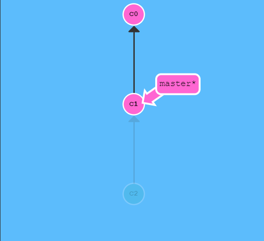
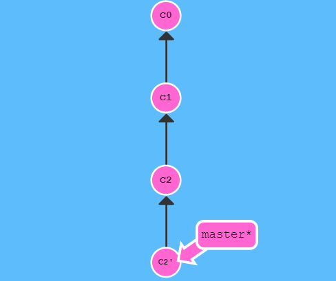

# Git

将修改添加到暂存区：`git add .`

提交记录：`git commit  -m "信息"`

创建新的分支：`git branch name`

切换到新的分支：`git checkout name`

新建并切换分支：`git checkout -b name`

删除合并的分支：`git branch -d name`   

删除未合并的分支：`git branch -D name`

### 在历史树上移动分支

移动HEAD：`git checkout HEAD^`或者`git checkout HEAD~4`

强制移动分支：`git branch -f master  HEAD^`     将master分支移动到指定的节点

### 撤销操作

本地撤销：`git reset HEAD^`；撤销后的c2只是未加入暂存区



远程撤销：`git revert HEAD`

新提交记录 `C2'` 引入了**更改** —— 这些更改刚好是用来撤销 `C2` 这个提交的。也就是说 `C2'` 的状态与 `C1` 是相同的。



### 移动提交记录

`git cherry-pick c2 c3`:将c2、c3记录移动到HEAD后

### 合并分支

`git merge name` 将那么分支合并在当前分支上

若出现冲突，需要以下步骤：

- 解决冲突
- `git add .`  将修改后的文件加入暂存区
- `git commit -m` 进行提交

### 查看文件修改

工作目录与上次提交或暂存的区别：`git diff`

暂存区与上次提交的区别：`git diff --cached`

工作目录与上次提交的区别：`git diff HEAD`

当前工作目录与name分支的区别：`git diff name`

不需要查看每个文件具体的改动，只是看大概：`git diff --stat`

### 远程通信

`git clone` 地址

`git fetch` 更新本地仓库

- 从远程仓库下载本地仓库中缺失的提交记录
- 更新远程分支指针(如 `o/master`)
- `git fetch` 实际上将本地仓库中的**远程分支**更新成了**远程仓库相应分支**最新的状态

`git fetch` 并不会改变你本地仓库的状态。它**不会更新你的 `master` 分支**，也不会修改你磁盘上的文件

如果需要将本地分支与远程分支进行合并，还需要执行`git merge origin/master`

`git pull`可以完成记录下载以及合并操作两个步骤，即`git fetch`和`git merge`

`git pull --rebase` 是`git fetch`和`git rebase`的操作集合

### 远程跟踪

`git checkout -b name origin/master`   创建一个name分支关联远程master

`git branch -u origin/master name`    name远程分支建立关联

`git branch -u origin/master` 当前所在分支与远程分支建立关联

### 推送

`git push <place> <master>`：将本地master分支推送到origin上。

`git push origin <source>:<destination>` 将本地的source分支提交到destination分支上，如果远程分支不存在将会自动建立分支。

如果<source>为空，那么远程分支会被删除。

`git fetch origin :foo`  会在本地新建分支；


`git pull origin foo` 相当于：

```shell
git fetch origin foo; git merge o/foo
```

还有...

`git pull origin bar~1:bugFix` 相当于：

```shell
git fetch origin bar~1:bugFix; git merge bugFix
```