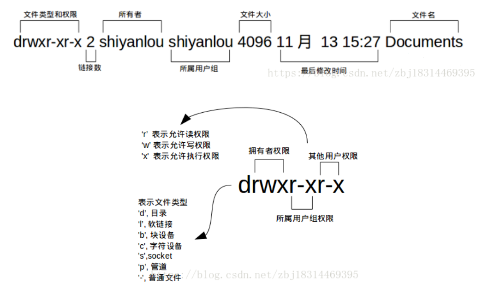
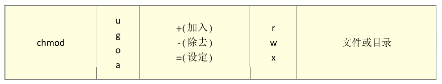
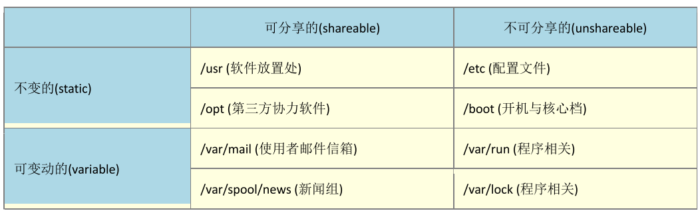
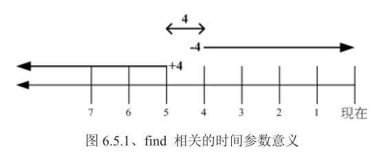

# 文件权限



权限共有三组：第一组是文件所有者的权限，第二组文件加入该群组账号的权限，第三组不属于前两者的权限

## 修改文件属性和权限

- `chgrp` ：改变文件所属群组 

  ```bash
  [root@study ~]# chgrp [-R] dirname/filename ... 
  选项与参数： -R : 进行递归(recursive)的持续变更，亦即连同次目录下的所有文件、目录 都更新成为这个群组之意。常常用在变更某一目录内所有的文件之情况。
  范例： 
  [root@study ~]# chgrp users initial-setup-ks.cfg 
  [root@study ~]# ls -l 
  -rw-r--r--. 1 root users 1864 May 4 18:01 initial-setup-ks.cfg 
  [root@study ~]# chgrp testing initial-setup-ks.cfg 
  chgrp: invalid group: `testing' <== 发生错误讯息啰～找不到这个群组名～
  ```

- `chown` ：改变文件拥有者和群组

  ```bash
  [root@study ~]# chown [-R] 账号名称 文件或目录 
  [root@study ~]# chown [-R] 账号名称:组名 文件或目录 
  选项与参数： -R : 进行递归(recursive)的持续变更，亦即连同次目录下的所有文件都变更
  范例：将 initial-setup-ks.cfg 的拥有者改为 bin 这个账号： 
  [root@study ~]# chown bin initial-setup-ks.cfg 
  [root@study ~]# ls -l 
  -rw-r--r--. 1 bin users 1864 May 4 18:01 initial-setup-ks.cfg
  范例：将 initial-setup-ks.cfg 的拥有者与群组改回为 root： 
  [root@study ~]# chown root:root initial-setup-ks.cfg 
  [root@study ~]# ls -l 
  -rw-r--r--. 1 root root 1864 May 4 18:01 initial-setup-ks.cfg
  ```

- `chmod` ：改变文件的权限, SUID, SGID, SBIT 等等的特性

  ### 数字类型修改权限

  修改文件权限涉及`owner/group/others` 三种身份各有自己的 `read/write/execute` 权限。

  各个权限分数`r:4   w:2   x:1`
  每种身份(owner/group/others)各自的三个权限(r/w/x)分数是需要累加的，例如当权限为： [-rwxrwx---] 分数 则是：
  `owner = rwx = 4+2+1 = 7` 

  `group = rwx = 4+2+1 = 7` 

  `others= --- = 0+0+0 = 0`

  ```bash
  [root@study ~]# chmod [-R] xyz 文件或目录 
  选项与参数： xyz : 就是刚刚提到的数字类型的权限属性，为 rwx 属性数值的相加。 -R : 进行递归(recursive)的持续变更，亦即连同次目录下的所有文件都会变更
  ```

  ### 符号类型修改权限

  `(1)user (2)group (3)others` 三种身份啦！那么我们就可以藉由 u, g, o 来代表三种身份的权限！此外， a 则代表 all 亦即全部 的身份！

  

  ```bash
  [root@study ~]# chmod u=rwx,go=rx .bashrc 
  # 注意喔！那个 u=rwx,go=rx 是连在一起的，中间并没有任何空格符！ [root@study ~]# ls -al .bashrc 
  -rwxr-xr-x. 1 root root 176 Dec 29 2013 .bashrc
  
  [root@study ~]# chmod a+w .bashrc
  [root@study ~]# chmod a-x .bashrc
  ```

*在 Linux 底下，我们的文件是否能被执行，则是藉由是否具有『x』这个权限来决定的！跟 档名是没有绝对的关系的！*

rwx都是和文档内容有关，和文件是否存在无关。

#### 权限对于目录的含义

- **r (read contents in directory)**：可进入文件夹，但不能看到内容
  表示具有读取目录结构列表的权限，所以当你具有读取(r)一个目录的权限时，表示你可以查询该目录下的 文件名数据。 可以利用 ls 指令将该目录的内容列表显示出来！

- **w (modify contents of directory)**：可以进入并且看到内容，但不能移动修改
  这个可写入的权限对目录来说，是很了不起的！ 因为他表示你具有异动该目录结构列表的权限，也就是底 下这些权限：

  - 建立新的文件与目录； 
  - 删除已经存在的文件与目录(不论该文件的权限为何！) 
  - 将已存在的文件或目录进行更名； 
  - 搬移该目录内的文件、目录位置

- **x (access directory)**：不能进入文件夹

  目录的 x 代表的是用户能否进入该目录成为工作目录的用途

## 文件目录分布

根据`Filesystem Hierarchy Standard (FHS)`标准



- 可分享的：可以分享给其他系统挂载使用的目录，所以包括执行文件与用户的邮件等数据， 是能够分享给 网络上其他主机挂载用的目录；
- 不可分享的：自己机器上面运作的装置文件或者是与程序有关的 socket 文件等， 由于仅与自身机器有关， 所以当然就不适合分享给其他主机了。
- 不变的：有些数据是不会经常变动的，跟随着 distribution 而不变动。 例如函式库、文件说明文件、系统管 理员所管理的主机服务配置文件等等；
- 可变动的：经常改变的数据，例如登录文件、一般用户可自行收受的新闻组等

最主要的：

- / (root, 根目录)：与开机系统有关； 
-  /usr (unix software resource)：与软件安装/执行有关； 
-  /var (variable)：与系统运作过程有关

## 文件目录管理

```bash
.       代表此层目录
..      代表上一层目录
-        代表前一个工作目录
~       代表『目前用户身份』所在的家目录
~account 代表 account 这个用户的家目录(account 是个账号名称
```

- cd：变换目录 

-  pwd：显示当前目录   **-P** ：显示出确实的路径，而非使用链接 (link) 路径。

  ```bash
  [root@study mail]# pwd 
  /var/mail    <==列出目前的工作目录
  [root@study mail]# pwd -P 
  /var/spool/mail   <==怎么回事？有没有加 -P 差很多～
  [root@study mail]# ls -ld 
  /var/mail lrwxrwxrwx. 1 root root 10 May 4 17:51 /var/mail -> spool/mail 
  # 看到这里应该知道为啥了吧？因为 /var/mail 是连结档，连结到 /var/spool/mail 
  # 所以，加上 pwd -P 的选项后，会不以连结文件的数据显示，而是显示正确的完整路径啊
  ```

- mkdir：建立一个新的目录 

  ```bash
  [root@study ~]# mkdir [-mp] 目录名称 
  选项与参数： -m ：配置文件案的权限喔！直接设定，不需要看预设权限 (umask) 的脸色～ 
  -p ：帮助你直接将所需要的目录(包含上层目录)递归建立起来！建立多级目录
  
  [root@study tmp]# mkdir -p test1/test2/test3/test4 
  # 加了这个 -p 的选项，可以自行帮你建立多层目录
  
  [root@study tmp]# mkdir -m 711 test2
  ```

-  rmdir：删除一个空的目录

  ```bash
  [root@study ~]# rmdir [-p] 目录名称 
  选项与参数： -p ：连同『上层』『空的』目录也一起删除
  # 不过要注意的是，这个 rmdir 仅能『删除空的目录』喔！
  ```

  那如果要将所有目录下的东西都杀掉, 这 个时候就必须使用『 `rm -r test` 』

### 文件的检视  ls

```bash
root@study ~]# ls [-aAdfFhilnrRSt] 文件名或目录名称.. 
[root@study ~]# ls [--color={never,auto,always}] 文件名或目录名称.. [root@study ~]# ls [--full-time] 文件名或目录名称.. 
选项与参数： 
-a ：全部的文件，连同隐藏档( 开头为 . 的文件) 一起列出来(常用) 
-A ：全部的文件，连同隐藏档，但不包括 . 与 .. 这两个目录 
-d ：仅列出目录本身，而不是列出目录内的文件数据(常用) 
-f ：直接列出结果，而不进行排序 (ls 预设会以档名排序！) 
-F ：根据文件、目录等信息，给予附加数据结构，例如： *:代表可执行文件； /:代表目录； =:代表 socket 文件； |:代表 FIFO 文件；
-h ：将文件容量以人类较易读的方式(例如 GB, KB 等等)列出来； 
-i ：列出 inode 号码，inode 的意义下一章将会介绍； 
-l ：长数据串行出，包含文件的属性与权限等等数据；(常用) 
-n ：列出 UID 与 GID 而非使用者与群组的名称 (UID 与 GID 会在账号管理提到！) 
-r ：将排序结果反向输出，例如：原本档名由小到大，反向则为由大到小；
-R ：连同子目录内容一起列出来，等于该目录下的所有文件都会显示出来； 
-S ：以文件容量大小排序，而不是用档名排序； 
-t ：依时间排序，而不是用档名。 
--color=never ：不要依据文件特性给予颜色显示； 
--color=always ：显示颜色 
--color=auto ：让系统自行依据设定来判断是否给予颜色 
--full-time ：以完整时间模式 (包含年、月、日、时、分) 输出 
--time={atime,ctime} ：输出 access 时间或改变权限属性时间 (ctime) 而非内容变更时间 (modification time)
```

### 复制、删除与移动： cp, rm, mv

- CP

  ```bash
  [root@study ~]# cp [-adfilprsu] 来源文件(source) 目标文件(destination) 
  [root@study ~]# cp [options] source1 source2  .... directory 
  选项与参数： 
  -a ：相当于 -dr --preserve=all 的意思，至于 dr 请参考下列说明；(常用) 
  -d ：若来源文件为链接文件的属性(link file)，则复制链接(实际)文件属性而非文件本身； 
  -f ：为强制(force)的意思，若目标文件已经存在且无法开启，则移除后再尝试一次； -i ：若目标文件(destination)已经存在时，在覆盖时会先询问动作的进行(常用) 
  -l ：进行硬式连结(hard link)的连结档建立，而非复制文件本身； 
  -p ：连同文件的属性(权限、用户、时间)一起复制过去，而非使用默认属性(备份常用)； 
  -r ：递归持续复制，用于目录的复制行为；(常用) 
  -s ：复制成为符号链接文件 (symbolic link)，亦即『快捷方式』文件； 
  -u ：destination 比 source 旧才更新 destination，或 destination 不存在的情况下才复制。
  --preserve=all ：除了 -p 的权限相关参数外，还加入 SELinux 的属性, links, xattr 等也复制了。 
  最后需要注意的，如果来源档有两个以上，则最后一个目的文件一定要是『目录』才行！
  ```

- rm

  ```bash
  [root@study ~]# rm [-fir] 文件或目录 
  选项与参数： 
  -f ：就是 force 的意思，忽略不存在的文件，不会出现警告讯息； 
  -i ：互动模式，在删除前会询问使用者是否动作 
  -r ：递归删除啊！最常用在目录的删除了！这是非常危险的选项！！！
  ```

- mv (移动文件与目录，或更名)

  ```bash
  [root@study ~]# mv [-fiu] source destination 
  [root@study ~]# mv [options] source1 source2 source3 .... directory 
  选项与参数： 
  -f ：force 强制的意思，如果目标文件已经存在，不会询问而直接覆盖； 
  -i ：若目标文件 (destination) 已经存在时，就会询问是否覆盖！ 
  -u ：若目标文件已经存在，且 source 比较新，才会更新 (update)
  ```

- 取得路径的文件名与目录名称

  ```bash
  [root@study ~]# basename /etc/sysconfig/network 
  network         <== 很简单！就取得最后的档名～
  [root@study ~]# dirname /etc/sysconfig/network 
  /etc/sysconfig  <== 取得的变成目录名了！
  ```

### 文件内容查阅

- cat 由第一行开始显示文件内容   -n打印行号  -E显示换行符($)  -T显示Tab(^)

-  tac 从最后一行开始显示，可以看出 tac 是 cat 的倒着写！ 

-  nl 显示的时候，顺道输出行号！ 

-  more 一页一页的显示文件内容 

  more 这个程序的运作过程中，你有几个按键可以按的：

  - 空格键 (space)：代表向下翻一页； 
  - Enter                ：代表向下翻『一行』；
  - /字符串           ：代表在这个显示的内容当中，向下搜寻『字符串』这个关键词；
  -  :f                     ：立刻显示出文件名以及目前显示的行数；
  -  q                     ：代表立刻离开 more ，不再显示该文件内容。
  - b 或 [ctrl]-b       ：代表往回翻页，不过这动作只对文件有用，对管线无用

- **less 与 more 类似，但是比 more 更好的是，他可以往前翻页！** 

  - 空格键 ：向下翻动一页； 
  -  [pagedown]：向下翻动一页； 
  -  [pageup] ：向上翻动一页； 
  -  /字符串 ：向下搜寻『字符串』的功能； 
  - ?字符串 ：向上搜寻『字符串』的功能； 
  - n   ：重复前一个搜寻 (与 / 或 ? 有关！)
  -  N   ：反向的重复前一个搜寻 (与 / 或 ? 有关！)
  -  g   ：前进到这个资料的第一行去；
  -  G   ：前进到这个数据的最后一行去 (注意大小写)；
  -  q    ：离开 less 这个程序；

-  head 只看头几行  *-n ：后面接数字，代表显示几行的意思*

-  tail 只看尾巴几行 

-  od 以二进制的方式读取文件内容！

### 修改时间

三个时间的意义：

- modification time (mtime)： 当该文件的『内容数据』变更时，就会更新这个时间！内容数据指的是文件的内容，而不是文件的属性或 权限喔！（默认显示）
- status time (ctime)： 当该文件的『状态 (status)』改变时，就会更新这个时间，举例来说，像是权限与属性被更改了，都会更新 这个时间啊。
- access time (atime)： 当『该文件的内容被取用』时，就会更新这个读取时间 (access)。举例来说，我们使用 cat 去读取 /etc/man_db.conf ， 就会更新该文件的 atime 了。

```bash
[root@study ~]# touch [-acdmt] 文件 
选项与参数： 
-a ：仅修订 access time； 
-c ：仅修改文件的时间，若该文件不存在则不建立新文件； 
-d ：后面可以接欲修订的日期而不用目前的日期，也可以使用 
--date="日期或时间" 
-m ：仅修改 mtime ； 
-t ：后面可以接欲修订的时间而不用目前的时间，格式为[YYYYMMDDhhmm]
```

- 观察文件类型：file

```bash
[root@study ~]# file ~/.bashrc 
/root/.bashrc: ASCII text <==告诉我们是 ASCII 的纯文本档啊
```

### 指令与文件的搜寻

- which (寻找『执行档』)

  ```bash
  [root@study ~]# which [-a] command 
  选项或参数： 
  -a ：将所有由 PATH 目录中可以找到的指令均列出，而不止第一个被找到的指令名称
  范例一：搜寻 ifconfig 这个指令的完整文件名 
  [root@study ~]# which ifconfig 
  /sbin/ifconfig
  ```

- `whereis` (由一些特定的目录中寻找文件文件名)

  通常 find 不很常用的！因 为速度慢之外， 也很操硬盘！一般我们都是先使用 `whereis` 或者是 `locate` 来检查，如果真的找不到 了，才以 find 来搜寻呦！

  ```bash
  [root@study ~]# whereis [-bmsu] 文件或目录名 
  选项与参数： 
  -l :可以列出 whereis 会去查询的几个主要目录
  -b :只找 binary 格式的文件 
  -m :只找在说明文件 manual 路径下的文件 
  -s :只找 source 来源文件 
  -u :搜寻不在上述三个项目当中的其他特殊文件
  范例一：请找出 ifconfig 这个档名 
  [root@study ~]# whereis ifconfig 
  ifconfig: /sbin/ifconfig /usr/share/man/man8/ifconfig.8.gz
  ```

- `locate`

  ```bash
  [root@study ~]# locate [-ir] keyword 
  选项与参数： 
  -i ：忽略大小写的差异； 
  -c ：不输出档名，仅计算找到的文件数量 
  -l ：仅输出几行的意思，例如输出五行则是 -l 5 
  -S ：输出 locate 所使用的数据库文件的相关信息，包括该数据库纪录的文件/目录数量等 -r ：后面可接正规表示法的显示方式
  ```

  根据自建的索引进行搜索，索引一般为每天更新一次。也可以手动更新索引

  `updatedb`：根据 /etc/updatedb.conf 的设定去搜寻系统硬盘内的文件名，并更新 /var/lib/mlocate 内的数据库 文件；

- find

  ```bash
  [root@study ~]# find [PATH] [option] [action] 
  选项与参数： 
  1. 与时间有关的选项：共有 -atime, -ctime 与 -mtime ，以 -mtime 说明 
  -mtime n ：n 为数字，意义为在 n 天之前的『一天之内』被更动过内容的文件； 
  -mtime +n ：列出在 n 天之前(不含 n 天本身)被更动过内容的文件档名； 
  -mtime -n ：列出在 n 天之内(含 n 天本身)被更动过内容的文件档名。 
  -newer file ：file 为一个存在的文件，列出比 file 还要新的文件档名
  
  2. 与使用者或组名有关的参数： 
  -uid n ：n 为数字，这个数字是用户的账号 ID，亦即 UID ，这个 UID 是记录在 /etc/passwd 里面与账号名称对应的数字。这方面我们会在第四篇介绍。
  -gid n ：n 为数字，这个数字是组名的 ID，亦即 GID，这个 GID 记录在 /etc/group，相关的介绍我们会第四篇说明～
  -user name ：name 为使用者账号名称喔！例如 dmtsai 
  -group name：name 为组名喔，例如 users ； 
  -nouser ：寻找文件的拥有者不存在 /etc/passwd 的人！ 
  -nogroup ：寻找文件的拥有群组不存在于 /etc/group 的文件！ 当你自行安装软件时，很可能该软件的属性当中并没有文件拥有者， 这是可能的！在这个时候，就可以使用 
  -nouser 与 -nogroup 搜寻。
  
  3. 与文件权限及名称有关的参数： 
  -name filename：搜寻文件名为 filename 的文件； 
  -size [+-]SIZE：搜寻比 SIZE 还要大(+)或小(-)的文件。这个 SIZE 的规格有： c: 代表 byte， k: 代表 1024bytes。所以，要找比 50KB 还要大的文件，就是『 -size +50k 』
  -type TYPE ：搜寻文件的类型为 TYPE 的，类型主要有：一般正规文件 (f), 装置文件 (b, c), 目录 (d), 连结档 (l), socket (s), 及 FIFO (p) 等属性。
  -perm mode ：搜寻文件权限『刚好等于』 mode 的文件，这个 mode 为类似 chmod 的属性值，举例来说， -rwsr-xr-x 的属性为 4755 ！
  ```

  

## 添加用户

```bash
[root@study ~]# groupadd project       <==增加新的群组
[root@study ~]# useradd -G project alex <==建立 alex 账号，且支持 project [root@study ~]# useradd -G project arod <==建立 arod 账号，且支持 project [root@study ~]# id alex    <==查阅 alex 账号的属性
```

## 文件压缩及打包

```bash
*.Z
*.zip *.gz
*.bz2 *.xz
*.tar
compress 程序压缩的文件； 
zip 程序压缩的文件； 
gzip 程序压缩的文件； 
bzip2 程序压缩的文件； 
xz 程序压缩的文件；
tar 程序打包的数据，并没有压缩过；
*.tar.gz tar 程序打包的文件，其中并且经过 gzip 的压缩 
*.tar.bz2 tar 程序打包的文件，其中并且经过 bzip2 的压缩 
*.tar.xz tar 程序打包的文件，其中并且经过 xz 的压缩
```

## vim编辑器

## Shell

变量的设定规则
1. 变量与变量内容以一个等号『=』来连结，如下所示： `『myname=VBird』`
2. 等号两边不能直接接**空格符**，如下所示为错误： 『myname = VBird』或『myname=VBird Tsai』
3. 变量名称**只能是英文字母与数字**，但是开头字符不能是数字，如下为错误： 『2myname=VBird』
4. 变量内容若有空格符可使用双引号『"』或单引号『'』将变量内容结合起来，但**双引号**内的特殊字符如 $ 等，可以保有原本的特性，如下所示： 『var="lang is $LANG"』则『echo $var』可得『lang is zh_TW.UTF-8』
o ***单引号***内的特殊字符则仅为一般字符 (纯文本)，如下所示： 『var='lang is $LANG'』则『echo $var』可得『lang is $LANG』
5. 可用跳脱字符『 \ 』将特殊符号(如 [Enter], $, \, 空格符, '等)变成一般字符，如： 『myname=VBird\ Tsai』
6. 在一串指令的执行中，还需要藉由其他额外的指令所提供的信息时，可以使用反单引号『`指令`』或 『$(指 令)』。特别注意，那个 ` 是键盘上方的数字键 1 左边那个按键，而不是单引号！ 例如想要取得核心版本 的设定： 『version=$(uname -r)』再『echo $version』可得『3.10.0-229.el7.x86_64』
7. 若该变量为**扩增变量内容**时，则可用 "$变量名称" 或 ${变量} 累加内容，如下所示： 『PATH="$PATH":/home/bin』或『PATH=${PATH}:/home/bin』
8. 若该变量需要在其他子程序执行，则需要以 export 来使变量变成环境变量： 『export PATH』
9. 通常大写字符为系统默认变量，自行设定变量可以使用小写字符，方便判断 (纯粹依照使用者兴趣与嗜好) ；
10. **取消变量**的方法为使用 `unset` ：『unset 变量名称』例如取消 myname 的设定： 『unset myname』

- 用 `env` 观察环境变量与常见环境变量说明

  ```bash
  范例一：列出目前的 shell 环境下的所有环境变量与其内容。 
  [dmtsai@study ~]$ env
  HOSTNAME=study.centos.vbird   <== 这部主机的主机名 
  TERM=xterm                    <== 这个终端机使用的环境是什么类型
  SHELL=/bin/bash            <== 目前这个环境下，使用的 Shell 是哪一个程序？
  HISTSIZE=1000          <== 『记录指令的笔数』在 CentOS 默认可记录 1000 笔
  OLDPWD=/home/dmtsai    <== 上一个工作目录的所在
  LC_ALL=en_US.utf8      <== 由于语系的关系，鸟哥偷偷丢上来的一个设定
  USER=dmtsai            <== 使用者的名称啊！
  LS_COLORS=rs=0:di=01;34:ln=01;36:mh=00:pi=40;33:so=01;35:do=01;35:bd=40;33;01:cd=40;33;01: or=40;31;01:mi=01;05;37;41:su=37;41:sg=30;43:ca=30;41:tw=30;42:ow=34;42:st=37;44:ex=01;32: *.tar=01...              <== 一些颜色显示 
  MAIL=/var/spool/mail/dmtsai    <== 这个用户所取用的 mailbox 位置
  PATH=/usr/local/bin:/usr/bin:/usr/local/sbin:/usr/sbin:/home/dmtsai/.local/bin:/home/dmtsai/bin 
  PWD=/home/dmtsai   <== 目前用户所在的工作目录 (利用 pwd 取出！)
  LANG=zh_TW.UTF-8    <== 这个与语系有关，底下会再介绍！
  HOME=/home/dmtsai    <== 这个用户的家目录啊！
  LOGNAME=dmtsai       <== 登入者用来登入的账号名称
  _=/usr/bin/env       <== 上一次使用的指令的最后一个参数(或指令本身
  ```

  环境变量相当于全局变量     export可以将局部变量转换为全局变量

  自定义变量相当于局部量

- read读取键盘输入

  ```bash
  [dmtsai@study ~]$ read [-pt] variable 
  选项与参数： 
  -p ：后面可以接提示字符！ 
  -t ：后面可以接等待的『秒数！』这个比较有趣～不会一直等待使用者啦！
  
  范例一：让用户由键盘输入一内容，将该内容变成名为 atest 的变量 
  [dmtsai@study ~]$ read atest 
  This is a test   <==此时光标会等待你输入！请输入左侧文字看看
  [dmtsai@study ~]$ echo ${atest} 
  This is a test   <==你刚刚输入的数据已经变成一个变量内容！
  
  范例二：提示使用者 30 秒内输入自己的大名，将该输入字符串作为名为 named 的变量内容 
  [dmtsai@study ~]$ read -p "Please keyin your name: " -t 30 named Please keyin your name: VBird Tsai  <==注意看，会有提示字符喔！ [dmtsai@study ~]$ echo ${named} 
  VBird Tsai          <==输入的数据又变成一个变量的内容了！
  ```

- declare 声明变量

  ```bash
  [dmtsai@study ~]$ declare [-aixr] variable 
  选项与参数： 
  -a ：将后面名为 variable 的变量定义成为数组 (array) 类型 
  -i ：将后面名为 variable 的变量定义成为整数数字 (integer) 类型 
  -x ：用法与 export 一样，就是将后面的 variable 变成环境变量； 
  -r ：将变量设定成为 readonly 类型，该变量不可被更改内容，也不能 unset
  
  范例一：让变量 sum 进行 100+300+50 的加总结果 
  [dmtsai@study ~]$ sum=100+300+50 
  [dmtsai@study ~]$ echo ${sum} 100+300+50 <==怎么没有计算加总？因为这是文字型态的变量属性啊！ 
  [dmtsai@study ~]$ declare -i sum=100+300+50
  [dmtsai@study ~]$ echo ${sum} 
  450
  ```

  - 变量类型默认为『字符串』，所以若不指定变量类型，则 1+2 为一个『字符串』而不是『计算式』。 所以 上述第一个执行的结果才会出现那个情况的；
  - bash 环境中的数值运算，预设最多仅能到达整数形态，所以 1/3 结果是 0；

- 信息的选取cut, grep

  ```bash
  [dmtsai@study ~]$ cut -d'分隔字符' -f fields <==用于有特定分隔字符 [dmtsai@study ~]$ cut -c 字符区间    <==用于排列整齐的讯息
  选项与参数： 
  -d ：后面接分隔字符。与 -f 一起使用； 
  -f ：依据 -d 的分隔字符将一段讯息分区成为数段，用 -f 取出第几段的意思； 
  -c ：以字符 (characters) 的单位取出固定字符区间；
  
  范例一：将 PATH 变量取出，我要找出第五个路径。 
  [dmtsai@study ~]$ echo ${PATH} /usr/local/bin:/usr/bin:/usr/local/sbin:/usr/sbin:/home/dmtsai/.local/bin:/home/dmtsai/bin 
  #1 | 2 | 3 | 4 | 5 | 6
  [dmtsai@study ~]$ echo ${PATH} | cut -d ':' -f 5 
  # 如同上面的数字显示，我们是以『 : 』作为分隔，因此会出现 /home/dmtsai/.local/bin 
  # 那么如果想要列出第 3 与第 5 呢？，就是这样： 
  [dmtsai@study ~]$ echo ${PATH} | cut -d ':' -f 3,5
  
  范例二：将 export 输出的讯息，取得每一行第 12 字符以后的所有字符串 
  [dmtsai@study ~]$ export 
  declare -x HISTCONTROL="ignoredups" 
  declare -x HISTSIZE="1000" 
  declare -x HOME="/home/dmtsai" 
  declare -x HOSTNAME="study.centos.vbird" .....(其他省略)..... 
  # 注意看，每个数据都是排列整齐的输出！如果我们不想要『 declare -x 』时，就得这么做：
  [dmtsai@study ~]$ export | cut -c 12
  HISTCONTROL="ignoredups" 
  HISTSIZE="1000" 
  HOME="/home/dmtsai" 
  HOSTNAME="study.centos.vbird" .....(其他省略)..... # 知道怎么回事了吧？用 -c 可以处理比较具有格式的输出数据！ # 我们还可以指定某个范围的值，例如第 12-20 的字符，就是 cut -c 12-20 等等！
  ```

  ```bash
  [dmtsai@study ~]$ grep [-acinv] [--color=auto] '搜寻字符串' filename 选项与参数： 
  -a ：将 binary 文件以 text 文件的方式搜寻数据 
  -c ：计算找到 '搜寻字符串' 的次数 
  -i ：忽略大小写的不同，所以大小写视为相同 
  -n ：顺便输出行号 
  -v ：反向选择，亦即显示出没有 '搜寻字符串' 内容的那一行！ 
  --color=auto ：可以将找到的关键词部分加上颜色的显示喔！
  
  范例一：将 last 当中，有出现 root 的那一行就取出来； 
  [dmtsai@study ~]$ last | grep 'root'
  
  范例二：与范例一相反，只要没有 root 的就取出！ 
  [dmtsai@study ~]$ last | grep -v 'root'
  
  范例三：在 last 的输出讯息中，只要有 root 就取出，并且仅取第一栏 [dmtsai@study ~]$ last | grep 'root' |cut -d ' ' -f1 
  # 在取出 root 之后，利用上个指令 cut 的处理，就能够仅取得第一栏啰！
  
  范例四：取出 /etc/man_db.conf 内含 MANPATH 的那几行 
  [dmtsai@study ~]$ grep --color=auto 'MANPATH' /etc/man_db.conf 
  ....(前面省略).... 
  MANPATH_MAP MANPATH_MAP MANPATH_MAP
  /usr/games /opt/bin /opt/sbin
  /usr/share/man /opt/man /opt/man
  # 神奇的是，如果加上 --color=auto 的选项，找到的关键词部分会用特殊颜色显示喔！
  ```


## 软件包管理

> Advanced Package Tool，又名apt-get，是一款适用于[Unix](https://baike.baidu.com/item/Unix)和[Linux](https://baike.baidu.com/item/Linux)系统的应用程序管理器。

```bash
sudo apt-get install XXX     #一键安装，自动检测依赖并安装
sudo apt-get install -y XXX  #不需要重复确认安装
sudo apt-get install -q XXX  #静默安装，屏蔽不必要的bug
sudo apt-get remove XXX      #卸载软件，但不卸载配置文件
sudo apt-get purge XXX       #卸载软件同时卸载相应的配置文件
sudo apt-get autoremove      #卸载不再使用的依赖（不常用）
sudo apt-get update          #更新包的来源
sudo apt-get upgrade         #将系统中的旧版本升级
```

### apt和apt-get命令之间的区别

虽然 apt 与 apt-get 有一些类似的命令选项，但它并不能完全向下兼容 apt-get 命令。也就是说，可以用 apt 替换部分 apt-get 系列命令，但不是全部。

| apt 命令         | 取代的命令           | 命令的功能                     |
| ---------------- | -------------------- | ------------------------------ |
| apt install      | apt-get install      | 安装软件包                     |
| apt remove       | apt-get remove       | 移除软件包                     |
| apt purge        | apt-get purge        | 移除软件包及配置文件           |
| apt update       | apt-get update       | 刷新存储库索引                 |
| apt upgrade      | apt-get upgrade      | 升级所有可升级的软件包         |
| apt autoremove   | apt-get autoremove   | 自动删除不需要的包             |
| apt full-upgrade | apt-get dist-upgrade | 在升级软件包时自动处理依赖关系 |
| apt search       | apt-cache search     | 搜索应用程序                   |
| apt show         | apt-cache show       | 显示装细节                     |

当然，apt 还有一些自己的命令：

| 新的apt命令      | 命令的功能                           |
| ---------------- | ------------------------------------ |
| apt list         | 列出包含条件的包（已安装，可升级等） |
| apt edit-sources | 编辑源列表                           |

需要大家注意的是：apt 命令也还在不断发展， 因此，你可能会在将来的版本中看到新的选项。

## 工作控制

- 直接将指令丢到背景中『执行』的 &

  ```bash
  [root@study ~]# tar -zpcf /tmp/etc.tar.gz /etc & 
  [1] 14432 <== [job number] PID 
  [root@study ~]# tar: Removing leading `/' from member names 
  # 在中括号内的号码为工作号码 (job number)，该号码与 bash 的控制有关。
  # 后续的 14432 则是这个工作在系统中的 PID。后续出现的数据是 tar 执行的数据流， 
  # 由于我们没有加上数据流重导向，所以会影响画面！不过不会影响前景的操作喔！
  [1]+ Done tar -zpcf /tmp/etc.tar.gz /etc  
  #就代表 [1] 这个工作已经完成 (Done)
  ```

- 将『目前』的工作丢到背景中『暂停』：[ctrl]-z

  > 如果我正在使用 vim ，却发现我有个文件不知道放在哪里，需要到 bash 环境下进行搜 寻，此时是否要结束 vim 呢？呵呵！当然不需要啊！只要暂时将 vim 给他丢到背景当中等待即可

  ```bash
  [root@study ~]# vim ~/.bashrc 
  # 在 vim 的一般模式下，按下 [ctrl]-z 这两个按键 
  [1]+ Stopped   vim ~/.bashrc
  [root@study ~]# <==顺利取得了前景的操控权！
  [root@study ~]# find / -print ....(输出省略).... 
  # 此时屏幕会非常的忙碌！因为屏幕上会显示所有的文件名。请按下 [ctrl]-z 暂停 
  [2]+ Stopped   find / -print
  ```

- 观察目前的背景工作状态： `jobs`

  ```bash
  [root@study ~]# jobs [-lrs]
  选项与参数： 
  -l ：除了列出 job number 与指令串之外，同时列出 PID 的号码； 
  -r ：仅列出正在背景 run 的工作； 
  -s ：仅列出正在背景当中暂停 (stop) 的工作。
  
  范例一：观察目前的 bash 当中，所有的工作，与对应的 PID 
  [root@study ~]# jobs -l 
  [1]- 14566 Stopped         vim ~/.bashrc
  [2]+ 14567 Stopped          find / -print
  ```

  那个 + 代表**最近**一个被丢进背景的工作，且目前在背景`fg`下预设会被取用的那个工作

- 将背景工作拿到前景来处理：`fg`

  ```bash
  [root@study ~]# fg %jobnumber 
  选项与参数： 
  %jobnumber ：jobnumber 为工作号码(数字)。注意，那个 % 是可有可无的！
  
  范例一：先以 jobs 观察工作，再将工作取出： 
  [root@study ~]# jobs -l 
  [1]- 14566 Stopped  vim ~/.bashrc
  [2]+ 14567 Stopped  find / -print
  [root@study ~]# fg <==预设取出那个 + 的工作，亦即 [2]。立即按下[ctrl]-z
  [root@study ~]# fg %1 <==直接规定取出的那个工作号码！再按下[ctrl]-z [root@study ~]# jobs -l 
  [1]+ 14566 Stopped  vim ~/.bashrc 
  [2]- 14567 Stopped  find / -print
  ```

- 让工作在背景下的状态变成运作中： `bg`

  > [ctrl]-z 可以将目前的工作丢到背景底下去『暂停』， 那么如何让一个工作在 背景底下『 Run 』呢？我们可以在底下这个案例当中来测试

  ```bash
  范例一：一执行 find / -perm /7000 > /tmp/text.txt 后，立刻丢到背景去暂停！ [root@study ~]# find / -perm /7000 > /tmp/text.txt 
  # 此时，请立刻按下 [ctrl]-z 暂停！ 
  [3]+ Stopped   find / -perm /7000 > /tmp/text.txt
  
  范例二：让该工作在背景下进行，并且观察他！！ 
  [root@study ~]# jobs ; bg %3 ; jobs 
  [1] Stopped   vim ~/.bashrc
  [2]- Stopped   find / -print
  [3]+ Stopped   find / -perm /7000 > /tmp/text.txt
  [3]+ find / -perm /7000 > /tmp/text.txt & 
  [1]- Stopped  vim ~/.bashrc 
  [2]+ Stopped  find / -print
  [3]   Running  find / -perm /7000 > /tmp/text.txt &
  ```

- 管理背景当中的工作： `kill`

  > 如果想要将该工作直接移除呢？或者是将该工作重新启动呢？这个时候就得需要给予该工作一个讯 号 (signal) ，让他知道该怎么作才好啊

  ```bash
  [root@study ~]# kill -signal %jobnumber 
  [root@study ~]# kill -l 
  选项与参数： 
  -l ：这个是 L 的小写，列出目前 kill 能够使用的讯号 (signal) 有哪些？ 
  signal ：代表给予后面接的那个工作什么样的指示啰！用 man signal 可知： 
  	-1 ：重新读取一次参数的配置文件 (类似 reload)； 
  	-2 ：代表与由键盘输入 [ctrl]-c 同样的动作；
      -9 ：立刻强制删除一个工作； 
      -15：以正常的进程方式终止一项工作。与 -9 是不一样的。
      
  范例一：找出目前的 bash 环境下的背景工作，并将该工作『强制删除』。 
  [root@study ~]# jobs 
  [1]+ Stopped  vim ~/.bashrc
  [2] Stopped   find / -print
  [root@study ~]# kill -9 %2; jobs 
  [1]+ Stopped  vim ~/.bashrc
  [2]  Killed   find / -print
  # 再过几秒你再下达 jobs 一次，就会发现 2 号工作不见了！因为被移除了！
  
  范例二：找出目前的 bash 环境下的背景工作，并将该工作『正常终止』掉。 [root@study ~]# jobs 
  [1]+ Stopped   vim ~/.bashrc
  [root@study ~]# kill -SIGTERM %1 
  # -SIGTERM 与 -15 是一样的！您可以使用 kill -l 来查阅！ 
  # 不过在这个案例中， vim 的工作无法被结束喔！因为他无法透过 kill 正常终止的意思！
  ```

  -9 这个 signal 通常是用在『强制删除一个不正常的工作』时所使用的， -15 则是 以正常步骤结束一项工作(15 也是默认值)

## 进程管理

- ps ：将某个时间点的进程运作情况撷取下来

  ```bash
  [root@study ~]# ps aux <==观察系统所有的进程数据 
  [root@study ~]# ps -lA <==也是能够观察所有系统的数据 
  [root@study ~]# ps axjf <==连同部分进程树状态 
  选项与参数： 
  -A ：所有的 process 均显示出来，与 -e 具有同样的效用； 
  -a ：不与 terminal 有关的所有 process ； 
  -u ：有效使用者 (effective user) 相关的 process ； 
  x ：通常与 a 这个参数一起使用，可列出较完整信息。 
  输出格式规划： 
  l ：较长、较详细的将该 PID 的的信息列出； 
  j ：工作的格式 (jobs format) 
  -f ：做一个更为完整的输出。
  ```

  