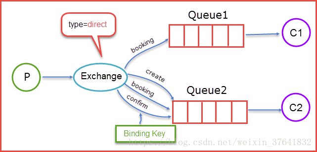
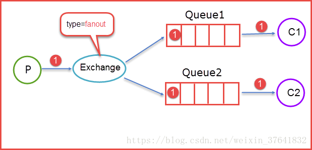
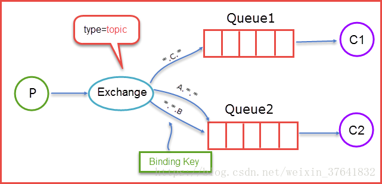

# RabbitMQ消息队列

## 消息队列的特点

### 优势

- 解耦
- 异步
- 削峰

### 缺点

- 系统可靠性降低
- 复杂度提高
- 暂时的不一致性

##  AMQP协议

>  AMQP，即Advanced Message Queuing Protocol,一个提供统一消息服务的应用层标准高级消息队列协议，是应用层协议的一个开放标准,为面向消息的中间件设计

### AMQP 模型简介


- **Broker**: 接收和分发消息的应用，RabbitMQ Server就是Message Broker。
- **Virtual host**: 出于多租户和安全因素设计的，把AMQP的基本组件划分到一个虚拟的分组中，类似于网络中的namespace概念。当多个不同的用户使用同一个RabbitMQ server提供的服务时，可以划分出多个vhost，每个用户在自己的vhost创建exchange／queue等。
- **Connection**: publisher／consumer和broker之间的TCP连接。断开连接的操作只会在client端进行，Broker不会断开连接，除非出现网络故障或broker服务出现问题。
- **Channel**: 如果每一次访问RabbitMQ都建立一个Connection，每次建立TCP Connection的开销将是巨大的，效率也较低。Channel是在connection内部建立的逻辑连接，如果应用程序支持多线程，通常每个thread创建单独的channel进行通讯，channel之间是完全隔离的。Channel作为轻量级的Connection极大减少了操作系统建立TCP connection的开销。
- **Exchange**: message到达broker的第一站，根据**分发规则**，匹配查询表中的routing key，分发消息到queue中去。常用的类型有：direct (point-to-point), topic (publish-subscribe) and fanout (multicast)。
- **Queue**: 消息最终被送到这里等待consumer取走。一个message可以被同时拷贝到多个queue中。
- **Binding**: exchange和queue之间的虚拟连接，binding中可以包含routing key。Binding信息被保存到exchange中的查询表中，用于message的分发依据

### 交换机类型

交换机是用来发送消息的AMQP实体。交换机拿到一个消息之后将它路由给一个或零个队列。它使用哪种路由算法是由交换机类型和被称作绑定（bindings）的规则所决定的。代理提供了四种交换机

| Name（交换机类型）            | Default pre-declared names（预声明的默认名称） |
| ----------------------------- | ---------------------------------------------- |
| Direct exchange（直连交换机） | (Empty string) and amq.direct                  |
| Fanout exchange（扇型交换机） | amq.fanout                                     |
| Topic exchange（主题交换机）  | amq.topic                                      |
| Headers exchange（头交换机）  | amq.match (and amq.headers in RabbitMQ)        |

除交换机类型外，在声明交换机时还可以附带许多其他的属性，其中最重要的几个分别是：

- Name
- Durability （消息代理重启后，交换机是否还存在）
- Auto-delete （当所有与之绑定的消息队列都完成了对此交换机的使用后，删掉它）
- Arguments（依赖代理本身）

#### 直连交换机

直连型交换机（direct exchange）是根据消息携带的路由键（routing key）将消息投递给对应绑定键的队列。直连交换机用来处理消息的单播路由（unicast routing）（尽管它也可以处理多播路由）。下边介绍它是如何工作的：

1）将一个队列绑定到某个交换机上时，赋予该绑定一个绑定键（Binding Key），假设为R；
2）当一个携带着路由键（Routing Key）为R的消息被发送给直连交换机时，交换机会把它路由给绑定键为R的队列。
直连交换机的***队列***通常是循环分发任务给多个消费者



当生产者（P）发送消息时 Rotuing key=booking 时，这时候将消息传送给 Exchange，Exchange 获取到生产者发送过来消息后，会根据自身的规则进行与匹配相应的 Queue，这时发现 Queue1 和 Queue2 都符合，就会将消息传送给这两个队列。

如果我们以 Rotuing key=create 和 Rotuing key=confirm 发送消息时，这时消息只会被推送到 Queue2 队列中，其他 Routing Key 的消息将会被丢弃。

#### 扇型交换机

扇型交换机（funout exchange）将消息路由给绑定到它身上的所有队列，而不理会绑定的路由键。如果 N 个队列绑定到某个扇型交换机上，当有消息发送给此扇型交换机时，交换机会将消息的拷贝分别发送给这所有的 N 个队列。扇型用来交换机处理消息的广播路由（broadcast routing）。


#### 主题交换机

前面提到的 direct 规则是严格意义上的匹配，换言之 Routing Key 必须与 Binding Key 相匹配的时候才将消息传送给 Queue.

而**Topic** 的路由规则是一种**模糊匹配**，可以通过通配符满足一部分规则就可以传送。

`binding key` 中可以存在两种特殊字符 “*” 与“#”，用于做模糊匹配，其中 “*” 用于匹配一个单词，“#”用于匹配多个单词（可以是零个）



当生产者发送消息 Routing Key=F.C.E 的时候，这时候只满足 Queue1，所以会被路由到 Queue 中；如果 Routing Key=A.C.E 这时候会被同是路由到 Queue1 和 Queue2 中，如果 Routing Key=A.F.B 时，这里只会发送一条消息到 Queue2 中。

#### 头交换机

headers 类型的 Exchange 不依赖于 routing key 与 binding key 的匹配规则来路由消息，而是根据发送的消息内容中的 headers 属性进行匹配。

头交换机可以视为直连交换机的另一种表现形式。但直连交换机的路由键必须是一个字符串，而头属性值则没有这个约束，它们甚至可以是整数或者哈希值（字典）等。灵活性更强（但实际上我们很少用到头交换机）。工作流程：

1）绑定一个队列到头交换机上时，会同时绑定多个用于匹配的头（header）。
2）传来的消息会携带header，以及会有一个 “x-match” 参数。当 “x-match” 设置为 “any” 时，消息头的任意一个值被匹配就可以满足条件，而当 “x-match” 设置为 “all” 的时候，就需要消息头的所有值都匹配成功。

#### 交换机小结

|类型名称	|路由规则|
|----------|-------------|
|Default	|自动命名的直交换机|
|Direct	|Routing Key==Binding Key，严格匹配|
|Fanout	|把发送到该 Exchange 的消息路由到所有与它绑定的 Queue 中|
|Topic	|Routing Key==Binding Key，模糊匹配|
|Headers	|根据发送的消息内容中的 headers 属性进行匹配|
### Queue队列

AMQP 中的队列（queue）跟其他消息队列或任务队列中的队列是很相似的：它们存储着即将被应用消费掉的消息。

#### 队列属性

队列跟交换机共享某些属性，但是队列也有一些另外的属性。

Name
Durable（消息代理重启后，队列依旧存在）
Exclusive（只被一个连接（connection）使用，而且当连接关闭后队列即被删除）
Auto-delete（当最后一个消费者退订后即被删除）
Arguments（一些消息代理用他来完成类似与 TTL 的某些额外功能）

#### 队列创建

队列在声明（declare）后才能被使用。如果一个队列尚不存在，声明一个队列会创建它。如果声明的队列已经存在，并且属性完全相同，那么此次声明不会对原有队列产生任何影响。如果声明中的属性与已存在队列的属性有差异，那么一个错误代码为 406 的通道级异常就会被抛出。

#### 队列持久化

持久化队列（Durable queues）会被存储在磁盘上，当**消息代理（broker）重启的时候，它依旧存在**。没有被持久化的队列称作暂存队列（Transient queues）。并不是所有的场景和案例都需要将队列持久化。

持久化的队列并**不会使得路由到它的消息也具有持久性**。倘若消息代理挂掉了，重新启动，那么在重启的过程中持久化队列会被重新声明，无论怎样，只有经过持久化的消息才能被重新恢复。

### 消息机制

#### 消息确认

消费者应用（Consumer applications） - 用来接受和处理消息的应用 - 在处理消息的时候偶尔会失败或者有时会直接崩溃掉。而且网络原因也有可能引起各种问题。AMQP 代理在什么时候删除消息才是正确的？AMQP 0-9-1 规范给我们两种建议：

1）**自动确认模式**：当消息代理（broker）将消息发送给应用后立即删除。（使用 AMQP 方法：basic.deliver 或 basic.get-ok）)
2）**显式确认模式**：待应用（application）**发送一个确认回执**（acknowledgement）后再删除消息。（使用 AMQP 方法：basic.ack）

如果一个消费者在尚未发送确认回执的情况下挂掉了，那 AMQP 代理会将消息重新投递给另一个消费者。如果当时没有可用的消费者了，消息代理会死等下一个注册到此队列的消费者，然后再次尝试投递。

#### 拒绝消息

当一个消费者接收到某条消息后，处理过程有可能成功，有可能失败。应用可以向消息代理表明，本条消息由于 “拒绝消息（Rejecting Messages）” 的原因**处理失败**了（或者未能在此时完成）。

当拒绝某条消息时，应用可以告诉消息代理如何处理这条消息——**销毁它**或者**重新放入队列**。

当此队列只有一个消费者时，请确认不要由于拒绝消息并且选择了重新放入队列的行为而引起消息在同一个消费者身上无限循环的情况发生。

在 AMQP 中，basic.reject 方法用来执行拒绝消息的操作。但 basic.reject 有个限制：你不能使用它决绝多个带有确认回执（acknowledgements）的消息。

#### 预取消息

在多个消费者共享一个队列的案例中，明确指定在收到下一个确认回执前**每个消费者一次可以接受多少条消息**是非常有用的。这可以在试图批量发布消息的时候起到简单的负载均衡和提高消息吞吐量的作用。（例如，如果生产应用每分钟才发送一条消息，这说明处理工作尚在运行。）

注意，RabbitMQ 只支持通道级的预取计数，而不是连接级的或者基于大小的预取。

#### 消息属性

AMQP 模型中的消息（Message）对象是带有属性（Attributes）的。有些属性及其常见，以至于 AMQP 0-9-1 明确的定义了它们，并且应用开发者们无需费心思思考这些属性名字所代表的具体含义。例如：

Content type（内容类型）
Content encoding（内容编码）
Routing key（路由键）
Delivery mode (persistent or not)
投递模式（持久化 或 非持久化）
Message priority（消息优先权）
Message publishing timestamp（消息发布的时间戳）
Expiration period（消息有效期）
Publisher application id（发布应用的 ID）
有些属性是被 AMQP 代理所使用的，但是大多数是开放给接收它们的应用解释器用的。有些属性是可选的也被称作消息头（headers）。他们跟 HTTP 协议的 X-Headers 很相似。消息属性需要在消息被发布的时候定义。

#### 消息主体

AMQP 的消息除属性外，也含有一个**有效载荷** - Payload（消息实际携带的数据），它被 AMQP 代理当作不透明的字节数组来对待。

消息代理不会检查或者修改有效载荷。*消息可以只包含属性而不携带有效载荷*。它通常会使用类似 JSON 这种序列化的格式数据，为了节省，协议缓冲器和 MessagePack 将结构化数据序列化，以便以消息的有效载荷的形式发布。AMQP 及其同行者们通常使用 “content-type” 和 “content-encoding” 这两个字段来与消息沟通进行有效载荷的辨识工作，但这仅仅是基于约定而已。

#### 消息持久化

将保存在内存中的数据都写入磁盘，防止服务器重启后数据丢失；有哪些数据需要持久化保存呢？

元数据、消息需要持久化到磁盘；

磁盘节点：持久化的消息在到达队列时就被写入到磁盘，并且如果可以，持久化的消息也会在内存中保存一份备份，这样可以提高一定的性能，只有在内存吃紧的时候才会从内存中清除；

内存节点：非持久化的消息一般只保存在内存中，在内存吃紧的时候会被换入到磁盘中，以节省内存空间；。

简单地将消息发送给一个持久化的交换机或者路由给一个持久化的队列，并不会使得此消息具有持久化性质：它**完全取决与消息本身的持久模式（persistence mode）**。将消息以持久化方式发布时，会对性能造成一定的影响（就像数据库操作一样，健壮性的存在必定造成一些性能牺牲）。

#### Confirm发送方确认模式

Confirm发送方确认模式使用和事务类似，也是通过设置Channel进行发送方确认的。

**Confirm的三种实现方式：**

方式一：channel.waitForConfirms()普通发送方确认模式；

方式二：channel.waitForConfirmsOrDie()批量确认模式；

方式三：channel.addConfirmListener()异步监听发送方确认模式；


## RabbitMQ整合Spring

### 引入依赖

```xml
<!-- rabbitMQ依赖 -->
<dependency>
    <groupId>org.springframework.amqp</groupId>
    <artifactId>spring-rabbit</artifactId>
    <version>2.2.5.RELEASE</version>
</dependency>
```

在rabbit.xml中配置

```xml
<?xml version="1.0" encoding="utf-8"?>
<beans xmlns="http://www.springframework.org/schema/beans"
       xmlns:xsi="http://www.w3.org/2001/XMLSchema-instance"
       xmlns:rabbit="http://www.springframework.org/schema/rabbit"
       xmlns:context="http://www.springframework.org/schema/context"
       xsi:schemaLocation="http://www.springframework.org/schema/beans http://www.springframework.org/schema/beans/spring-beans.xsd
        http://www.springframework.org/schema/rabbit http://www.springframework.org/schema/rabbit/spring-rabbit-1.7.xsd http://www.springframework.org/schema/context https://www.springframework.org/schema/context/spring-context.xsd">

<!--加载多个propertise，需要添加ignore-unresolvable属性-->
    <context:property-placeholder location="classpath:/config/rabbitMQ.properties" ignore-unresolvable="true"/>
<!--定义rabbit连接-->
    <rabbit:connection-factory id="connectionFactory" host="localhost" port="${rabbit.port}"
                               username="${rabbit.username}" password="${rabbit.password}"/>
    
<!--也可以通过bean的方式创建connectionFactory  
    <bean class="com.rabbitmq.client.ConnectionFactory" id="connectionFactory2">
        <property name="host" value="localhost"/>
        <property name="port" value="${rabbit.port}"/>
        <property name="username" value="${rabbit.username}"/>
        <property name="password" value="${rabbit.password}"/>
    </bean>
-->

<!--创建rabbitMQ admin对象用来进行管理操作org.springframework.amqp.rabbit.core.RabbitAdmin-->
    <rabbit:admin connection-factory="connectionFactory"/>

<!--消息转换器-->
    <bean id="messageConverter" class="org.springframework.amqp.support.converter.Jackson2JsonMessageConverter"/>

    <!--定义rabbit模板，用来进行发送，接受操作  exchange="rabbitExchange"配置默认的exchange-->
    <rabbit:template connection-factory="connectionFactory" id="rabbitTemplate" message-converter="messageConverter"/>

<!--设置队列 durable:是否持久化；auto-delete:消费者全部断开后是否删除；exclusive:创建者可以使用的私有队列-->
    <rabbit:queue id="queue1" name="queue1" durable="true" auto-delete="false" exclusive="false"/>

<!--设置路由模式，以及绑定key-->
    <rabbit:direct-exchange name="directExchange" auto-delete="false" durable="true" id="directExchange">
        <rabbit:bindings>
            <rabbit:binding queue="queue1" key="queue1"/>
        </rabbit:bindings>
    </rabbit:direct-exchange>
    
<!--声明一个监听器-->
    <bean id="queueListenter" class="com.liu.rabbitMQ.QueueListenter"/>

<!--绑定监听器-->
    <rabbit:listener-container connection-factory="connectionFactory" acknowledge="auto">
        <rabbit:listener ref="queueListenter" queues="queue1"/>
    </rabbit:listener-container>
    
</beans>
```

```properties
rabbit.password=199481
rabbit.port = 5672
rabbit.username=admin
```

### 生产者

```java
package com.liu.rabbitMQ;

public interface MQProducer {

    public void sendDataToQueue(String queueKey,Object object);
}
```

```java
package com.liu.rabbitMQ.Impl;

import com.liu.rabbitMQ.MQProducer;
import org.slf4j.Logger;
import org.slf4j.LoggerFactory;
import org.springframework.amqp.rabbit.core.RabbitTemplate;
import org.springframework.beans.factory.annotation.Autowired;
import org.springframework.stereotype.Component;

/**
* 实现生产者逻辑
*/
@Component
public class MQProducerImpl implements MQProducer {

    @Autowired
    private RabbitTemplate rabbitTemplate;

    Logger logger = LoggerFactory.getLogger(MQProducerImpl.class);

    @Override
    public void sendDataToQueue(String queueKey, Object object) {
        try {
            logger.info("向队列发送了一条消息！");
            rabbitTemplate.convertAndSend("directExchange","queue1",object);
        }catch (Exception e){
            e.printStackTrace();
        }
    }
}
```