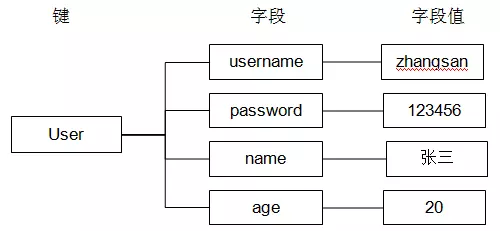
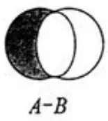
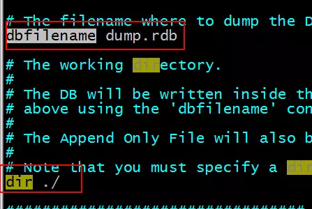

# Redis

## 启动Redis

使用cd命令切换目录到 C:\redis 运行 **redis-server.exe redis.conf** 。

后面的那个redis.conf可以省略，如果省略，会启用默认的。

### 连接Redis 

如果需要在远程 redis 服务上执行命令，同样我们使用的也是 **redis-cli** 命令。

```shell
$ redis-cli -h host -p port -a password
```

加上`--raw`参数解决中文显示乱码。

## Redis 数据类型

Redis支持五种数据类型：string（字符串），hash（哈希），list（列表），set（集合）及zset(sorted set：有序集合)。

### String 类型

赋值 `set key value`

```shell
127.0.0.1:6379> set test 123
OK
```

取值 `get key`

```shell
127.0.0.1:6379> get test
"123"
```

取值并赋值 `getset key value`

```shell
127.0.0.1:6379> getset test 321
"123"
127.0.0.1:6379> get test
"321"
复制代码
```

设置、获取**多个**键值 `mset key value [key value...] 、`mget key [key...]`

```shell
127.0.0.1:6379> mset k1 v1 k2 v2 k3 v3
OK
127.0.0.1:6379> mget k1 k2
1) "v1"
2) "v2"
```

删除 `del key`

```shell
127.0.0.1:6379> del test
(integer) 1
```

数值增减

- 递增数字 当存储的字符串是**整数**时，Redis提供了一个实用的命令INCR，其作用是让当前键值递增，并返回递增后的值。 语法：`incr key`

  ```shell
  127.0.0.1:6379> set num 1
  OK
  127.0.0.1:6379> incr num
  (integer) 2
  127.0.0.1:6379> incr num
  (integer) 3
  127.0.0.1:6379> incr num
  (integer) 4
  ```

- 增加指定的整数 `incrby key increment`

  ```shell
  127.0.0.1:6379> incrby num 2
  (integer) 8
  127.0.0.1:6379> incrby num 2
  (integer) 10
  复制代码
  ```

- 递减数值 `decr key`

  ```shell
  127.0.0.1:6379> decr num
  (integer) 9
  127.0.0.1:6379> decr num
  (integer) 8
  ```

- 减少指定的数值 decryby key decrement

  ```shell
  127.0.0.1:6379> decrby num 2
  (integer) 6
  127.0.0.1:6379> decrby num 2
  (integer) 4
  ```

向尾部追加值 APPEND的作用是**向键值的末尾追加value**。如果键不存在则将该键的值设置为value，即相当于 SET key value。返回值是追加后字符串的总长度。 语法：append key value

```shell
127.0.0.1:6379> set str hello
OK
127.0.0.1:6379> append str "world"
(integer) 10
127.0.0.1:6379> get str
"helloworld"
```

获取字符串长度 STRLEN命令返回键值的长度，如果键不存在则返回0。 语法：strlen key

```shell
127.0.0.1:6379> strlen str
(integer) 10
```

应用

- 自增主键 商品编号、订单号采用 string 的递增数字特性生成

### Hash 散列类型

#### 使用 string 的问题

假设有User对象以JSON序列化的形式存储到Redis中，User对象有id，username、password、age、name等属性，存储的过程如下： 保存、更新：User对象  json(string)  redis

如果在业务上只是更新age属性，其他的属性并不做更新我应该怎么做呢？ 如果仍然采用上边的方法在传输、处理时会造成资源浪费，下边讲的hash可以很好的解决这个问题。

#### 介绍

hash叫散列类型，它提供了字段和字段值的映射。字段值只能是字符串类型，不支持散列类型、集合类型等其它类型。如下：




#### 命令

赋值 HSET命令不区分插入和更新操作，当执行插入操作时HSET命令返回1，当执行更新操作时返回0。

- 一次只设置一个字段值 语法：`hset key field value`

  ```shell
  127.0.0.1:6379> hset user username zhangsan
  (integer) 1
  ```

- 一次设置多个字段值 语法：`hmset key field value [field value...]`

  ```shell
  127.0.0.1:6379> hmset user age 20 username lisi
  OK
  ```

- 当字段不存在时赋值，类似hset,区别在于如果字段存在，该命令不执行任何操作。 语法：`hsetnx key field value`

  ```shell
  127.0.0.1:6379> hsetnx user age 30
  (integer) 0
  ```

取值

- 一次获取一个字段值 语法：`hget key field`

  ```shell
  127.0.0.1:6379> hget user username
  "lisi"
  ```

- 一次可以获取多个字段值 语法：`hmget key field [field...]`

  ```shell
  127.0.0.1:6379> hmget user age username
  1) "20"
  2) "lisi"
  ```

- 获取所有字段值 语法：`hgetall key`

  ```shell
  127.0.0.1:6379> hgetall user
  1) "username"
  2) "lisi"
  3) "age"
  4) "20"
  ```

删除字段 可以删除一个或多个字段，返回值是被删除的字段的个数。 语法：`hdel key field [field...]`

```shell
127.0.0.1:6379> hdel user age
(integer) 1
127.0.0.1:6379> hdel user age username
(integer) 1
```

增加数字 语法：`hincrby key field increment`

```shell
127.0.0.1:6379> hincrby user age 2
(integer) 2
```

判断字段是否存在 语法：`hexists key field`

```shell
127.0.0.1:6379> hexists user age
(integer) 1
```

只获取字段名或字段值 语法： `hkeys key hvals key`

```shell
127.0.0.1:6379> hkeys user
1) "age"
```

获取字段数量 语法：`hlen key`

```shell
127.0.0.1:6379> hlen user
(integer) 1
```

应用 存储商品信息

```shell
127.0.0.1:6379> hlen user
(integer) 1
```

获取商品信息

```shell
127.0.0.1:6379> hgetall items:1001
1) "id"
2) "3"
3) "name"
4) "apple"
5) "price"
6) "5.00"
```

### List 类型

#### ArrayList 和 LinkedList 的区别

Arraylist是使用数组来存储数据，特点：查询快、增删慢

Linkedlist是使用双向链表存储数据，特点：增删快、查询慢，但是查询链表两端的数据也很快。

Redis的list是采用来**链表**来存储的，所以对于redis的list数据类型的操作，是操作list的两端数据来操作的。

#### 命令

向列表两端增加元素

- 向列表左边增加元素 语法：`lpush key value [value...]`

```shell
127.0.0.1:6379> lpush list:1 1 2 3
(integer) 3
```

- 向列表右边增加元素 语法：`rpush key value [value...]`

```shell
127.0.0.1:6379> rpush list:1 4 5 6
(integer) 6
```

查看列表 LRANGE命令是列表类型最常用的命令之一，获取列表中的某一片段，将返回start、stop之间的所有元素（包含两端的元素），索引从0开始。索引可以是负数，如：“-1”代表最后边的一个元素。

语法：`lrange key start stop`

```shell
127.0.0.1:6379> lrange list:1 0 2
1) "3"
2) "2"
3) "1"
127.0.0.1:6379> lrange list:1 0 -1
1) "3"
2) "2"
3) "1"
4) "4"
5) "5"
6) "6"
```

从列表两端弹出元素 LPOP命令从列表左边弹出一个元素，会分两步完成：

- 第一步是将列表左边的元素从列表中移除

- 第二步是返回被移除的元素值。 语法： `lpop key` `rpop key`

  ```shell
  127.0.0.1:6379> lpop list:1
  "3"
  127.0.0.1:6379> rpop list:1
  "6"
  ```

获取列表中元素的个数 语法：`llen key`

```shell
127.0.0.1:6379> llen list:1
(integer) 4
```

删除列表中指定的值 LREM命令会删除列表中前count个值为value的元素，返回实际删除的元素个数。根据count值的不同，该命令的执行方式会有所不同：

- 当count>0时， LREM会从列表左边开始删除。
- 当count<0时， LREM会从列表后边开始删除。
- 当count=0时， LREM删除所有值为value的元素。

语法：`lrem key count value`

获得/设置指定索引的元素值

- 获得指定索引的元素值 语法：`lindex key index`

  ```shell
  127.0.0.1:6379> lindex list:1 2
  "4"
  ```

- 设置指定索引的元素值 语法：`lset key index value`

  ```shell
  127.0.0.1:6379> lset list:1 2 2
  OK
  ```

只保留列表指定片段 指定范围和 lrange 一致 语法：`ltrim key start stop`

```shell
127.0.0.1:6379> lrange list:1 0 -1
1) "2"
2) "1"
3) "2"
4) "5"
127.0.0.1:6379> ltrim list:1 0 2
OK
127.0.0.1:6379> lrange list:1 0 -1
1) "2"
2) "1"
3) "2"
```

向列表中插入元素 该命令首先会在列表中从左到右查找值为pivot的元素，然后根据第二个参数是BEFORE还是AFTER来决定将value插入到该元素的前面还是后面。 语法：linsert key before | after pivot value

```shell
127.0.0.1:6379> lrange list:1 0 -1
1) "2"
2) "1"
3) "2"
127.0.0.1:6379> linsert list:1 after 1 9
(integer) 4
127.0.0.1:6379> lrange list:1 0 -1
1) "2"
2) "1"
3) "9"
4) "2"
```

将元素从一个列表转移到另一个列表 语法：rpoplpush source destination

```
127.0.0.1:6379> lrange list:1 0 -1
1) "2"
2) "1"
3) "9"
4) "2"
127.0.0.1:6379> rpoplpush list:1 newlist
"2"
127.0.0.1:6379> lrange newlist 0 -1
1) "2"
127.0.0.1:6379> lrange list:1 0 -1
1) "2"
2) "1"
3) "9"
复制代码
```

应用 在Redis中创建商品评论列表 用户发布商品评论，将评论信息转成json存储到list中。 用户在页面查询评论列表，从redis中取出json数据展示到页面。

定义商品评论列表key： 商品编号为1001的商品评论key【items: comment:1001】

### Set 类型

> 集合类型：无序、不可重复 列表类型：有序、可重复

#### 命令

增加/删除元素 语法：sadd key member [member...]

```shell
127.0.0.1:6379> sadd set a b c
(integer) 3
127.0.0.1:6379> sadd set a
(integer) 0
```

语法：srem key member [member...]

```shell
127.0.0.1:6379> srem set c
(integer) 1
```

获得集合中的所有元素 语法：smembers key

```shell
127.0.0.1:6379> smembers set
1) "b"
2) "a"
```

判断元素是否在集合中 语法：`sismember key member`

```shell
127.0.0.1:6379> sismember set a
(integer) 1
127.0.0.1:6379> sismember set h
(integer) 0
```

#### 运算命令

集合的差集运算 A-B 属于 A 并且 不属于 B 的元素构成的集合



语法：sdiff key [key...]


```shell
127.0.0.1:6379> sadd setA 1 2 3
(integer) 3
127.0.0.1:6379> sadd setB 2 3 4
(integer) 3
127.0.0.1:6379> sdiff setA setB 
1) "1"
127.0.0.1:6379> sdiff setB setA
1) "4"
```

集合的交集运算 属于A且属于B的元素构成的集合


语法：sinter key [key...]

```shell
127.0.0.1:6379> sinter setA setB
1) "2"
2) "3"
```

集合的并集运算 属于 A 或者 属于 B 的元素构成的集合


语法：sunion key [key...]

```shell
127.0.0.1:6379> sunion setA setB
1) "1"
2) "2"
3) "3"
4) "4"
```

获得集合中元素的个数 语法：scard key

```shell
127.0.0.1:6379> smembers setA
1) "1"
2) "2"
3) "3"
127.0.0.1:6379> scard setA
(integer) 3
```

从集合中弹出一个元素 注意:由于集合是无序的，所有spop命令会从集合中随机选择一个元素弹出。 语法：spop key

```shell
127.0.0.1:6379> spop setA
"2"
```

### Sortedset 类型

Sortedset 又叫 zset Sortedset 是有序集合，可排序的，但是唯一。 Sortedset 和 set 的不同之处，会给 set 中元素添加一个分数，然后通过这个分数进行排序。

#### 命令

##### 增加元素

向有序集合中加入一个元素和该元素的分数，如果该元素已经存在则会用新的分数替换原有的分数。返回值是新加入到集合中的元素个数，不包含之前已经存在的元素。 语法：zadd key score member [score member...]

```shell
127.0.0.1:6379> zadd scoreboard 80 zhangsan 89 lisi 94 wangwu
(integer) 3
127.0.0.1:6379> zadd scoreboard 97 lisi
(integer) 0
```

##### 获取元素分数

语法：zscore key member

```shell
127.0.0.1:6379> zscore scoreboard lisi
"97"
```

##### 删除元素

移除有序集key中的一个或多个成员，不存在的成员将被忽略。 当key存在但不是有序集类型时，返回一个错误。

语法：zrem key member [member...]

```shell
127.0.0.1:6379> zrem scoreboard lisi
(integer) 1
```

##### 获得排名在某个范围的元素列表

获得排名在某个范围的元素列表

- 按照元素分数从小到大的顺序返回索引从start到stop之间的所有元素（包含两端的元素） 语法：zrange key start stop [withscores]

  ```shell
  127.0.0.1:6379> zrange scoreboard 0 2
  1) "zhangsan"
  2) "wangwu"
  ```

- 按照元素分数从大到小的顺序返回索引从start到stop之间的所有元素（包含两端的元素） 语法：zrevrange key start stop [withscores]

  ```shell
  127.0.0.1:6379> zrevrange scoreboard 0 2
  1) "wangwu"
  2) "zhangsan"
  ```

  如果需要获得元素的分数可以在命令末尾加上 withscores 参数 ··· 

  ```shell
  127.0.0.1:6379> zrevrange scoreboard 0 2 withscores
  1. "wangwu"
  2. "94"
  3. "zhangsan"
  4. "80" ···
  ```

  

##### 获取元素的排名

- 从小到大 语法：zrank key member

```shell
127.0.0.1:6379> zrank scoreboard zhangsan
(integer) 0
```

- 从大到小 语法：zrevrank key member

```shell
127.0.0.1:6379> zrevrank scoreboard zhangsan
(integer) 1
```

##### 获得指定分数范围的元素

语法：zrangebyscore key min max [withscores] [limit offset count]

```shell
127.0.0.1:6379> ZRANGEBYSCORE scoreboard 90 97 WITHSCORES
1) "wangwu"
2) "94"
3) "lisi"
4) "97"
127.0.0.1:6379> ZRANGEBYSCORE scoreboard 70 100 limit 1 2
1) "wangwu"
2) "lisi"
```

##### 增加某个元素的分数

返回值是更改后的分数 语法：zincrby key increment member

```shell
127.0.0.1:6379> ZINCRBY scoreboard 4 lisi 
"101“
```

##### 获得集合中元素的数量

语法：zcard key

```shell
127.0.0.1:6379> zcard scoreboard
(integer) 3
```

##### 获得指定分数范围内的元素个数

语法：zcount key min max

```shell
127.0.0.1:6379> zcount scoreboard 80 90
(integer) 1
```

##### 按照排名范围删除元素

语法：zremrangebyrank key start stop

```shell
127.0.0.1:6379> zremrangebyrank scoreboard 0 1
(integer) 2
127.0.0.1:6379> zrange scoreboard 0 -1
1) "wangwu"
```

##### 按照分数范围删除元素

语法：zremrangebyscore key min max

```shell
127.0.0.1:6379> zadd scoreboard 84 zhangsan    
(integer) 1
127.0.0.1:6379> ZREMRANGEBYSCORE scoreboard 80 100
(integer) 1
```

##### 应用

###### 商品销售排行榜

需求：根据商品销售量对商品进行排行显示 思路：定义商品销售排行榜（sorted set集合），Key为items:sellsort，分数为商品销售量。

写入商品销售量：

- 商品编号1001的销量是9，商品编号1002的销量是10 192.168.101.3:7007> ZADD items:sellsort 9 1001 10 1002
- 商品编号1001的销量加1 192.168.101.3:7001> ZINCRBY items:sellsort 1 1001
- 商品销量前10名： 192.168.101.3:7001> ZRANGE items:sellsort 0 9 withscores

## keys 命令

### 常用命令

- keys 返回满足给定pattern 的所有key redis 127.0.0.1:6379> keys mylist*
  1. "mylist"
  2. "mylist5"
  3. "mylist6"
  4. "mylist7"
  5. "mylist8"
- exists 确认一个key 是否存在 示例：从结果来看，数据库中不存在HongWan 这个key，但是age 这个key 是存在的 redis 127.0.0.1:6379> exists HongWan (integer) 0 redis 127.0.0.1:6379> exists age (integer) 1 redis 127.0.0.1:6379>
- del 删除一个key redis 127.0.0.1:6379> del age (integer) 1 redis 127.0.0.1:6379> exists age (integer) 0
- rename 重命名key 示例：age 成功的被我们改名为age_new 了 redis 127.0.0.1:6379[1]> keys *
  1. "age" redis 127.0.0.1:6379[1]> rename age age_new OK redis 127.0.0.1:6379[1]> keys *
  2. "age_new" redis 127.0.0.1:6379[1]>
- type 返回值的类型 示例：这个方法可以非常简单的判断出值的类型 redis 127.0.0.1:6379> type addr string redis 127.0.0.1:6379> type myzset2 zset redis 127.0.0.1:6379> type mylist list redis 127.0.0.1:6379>

### 设置 key 的生存时间

Redis在实际使用过程中更多的用作缓存，然而缓存的数据一般都是需要设置生存时间的，即：到期后数据销毁。

|                          |                                                      |
| ------------------------ | ---------------------------------------------------- |
| EXPIRE key seconds       | 设置key的生存时间（单位：秒）key在多少秒后会自动删除 |
| TTL key                  | 查看key剩余的生存时间                                |
| PERSIST key              | 清除生存时间                                         |
| PEXPIRE key milliseconds | 生存时间设置单位为：毫秒                             |

例子：

```shell
192.168.101.3:7002> set test 1        设置test的值为1
OK
192.168.101.3:7002> get test            获取test的值
"1"
192.168.101.3:7002> EXPIRE test 5    设置test的生存时间为5秒
(integer) 1
192.168.101.3:7002> TTL test            查看test的生于生成时间还有1秒删除
(integer) 1
192.168.101.3:7002> TTL test
(integer) -2
192.168.101.3:7002> get test            获取test的值，已经删除
(nil)
```

## Redis 持久化方案

### Rdb 方式

Redis 默认的方式，redis 通过快照方式将数据持久化到磁盘中。

#### 设置持久化快照的条件

在 redis.conf 中修改持久化快照的条件：


#### 持久化文件的存储目录

在 redis.conf 中可以指定持久化文件的存储目录




#### Rdb 的问题

一旦redis非法关闭，那么会丢失最后一次持久化之后的数据。

如果数据不重要，则不必要关心。 如果数据不能允许丢失，那么要使用 aof 方式。

### Aof 方式

Redis 默认是不使用该方式持久化的。Aof 方式的持久化，是操作一次 redis 数据库，则将操作的记录存储到 aof 持久化文件中。

- 第一步：开启 aof 方式持久化方案。 将redis.conf中的appendonly改为yes，即开启aof方式的持久化方案。

  

  

- Aof文件存储的目录和rdb方式的一样。 Aof文件存储的名称

  

  

在使用aof和rdb方式时，如果redis重启，则数据从aof文件加载。

## 整合spring

### 添加依赖

```java
<!-- Redis客户端 -->
<dependency>
    <groupId>redis.clients</groupId>
    <artifactId>jedis</artifactId>
    <version>3.1.0</version>
</dependency>

<dependency>
            <groupId>com.alibaba</groupId>
            <artifactId>fastjson</artifactId>
            <version>1.2.62</version>
</dependency>
```

### 创建线程池以及配置

在redis.xml中

```xml
<?xml version="1.0" encoding="UTF-8"?>
<beans xmlns="http://www.springframework.org/schema/beans"
       xmlns:xsi="http://www.w3.org/2001/XMLSchema-instance"
       xmlns:context="http://www.springframework.org/schema/context"
       xsi:schemaLocation="http://www.springframework.org/schema/beans
       http://www.springframework.org/schema/beans/spring-beans-4.3.xsd
        http://www.springframework.org/schema/context https://www.springframework.org/schema/context/spring-context.xsd">

    <context:property-placeholder location="classpath:/config/redis.properties" ignore-unresolvable="true"/>

    <!--线程池配置类-->
    <bean class="redis.clients.jedis.JedisPoolConfig" id="jedisPoolConfig">
        <property name="maxIdle" value="${redis.maxIdle}"/>
        <property name="minIdle" value="${redis.minIdle}"/>
        <property name="maxTotal" value="${redis.maxTotal}"/>
        <property name="maxWaitMillis" value="${redis.maxWaitMillis}"/>
    </bean>

    <!--连接线程池-->
    <bean class="redis.clients.jedis.JedisPool">
        <constructor-arg name="poolConfig" ref="jedisPoolConfig"/>
        <constructor-arg name="timeout" value="${redis.timeout}"/>
        <constructor-arg name="host" value="${redis.host}"/>
        <constructor-arg name="port" value="${redis.port}"/>
    </bean>
</beans>
```

```properties
redis.host = localhost
# 最大空闲连接数数
redis.maxIdle = 10
redis.minIdle = 3
redis.maxTotal = 50
redis.maxWaitMillis = 300
redis.port = 6379
redis.timeout=3000
```

### 编写redis操作的封装类

```Java
package com.liu.redis;

import com.alibaba.fastjson.JSON;
import org.slf4j.Logger;
import org.slf4j.LoggerFactory;
import org.springframework.beans.factory.annotation.Autowired;
import org.springframework.stereotype.Component;
import redis.clients.jedis.Jedis;
import redis.clients.jedis.JedisPool;

@Component
public class RedisService {
    Logger logger = LoggerFactory.getLogger(RedisService.class);

    private JedisPool jedisPool = null;

    //使用构造器的方式进行依赖注入
    @Autowired
    public RedisService(JedisPool jedisPool) {
        this.jedisPool = jedisPool;
    }

    /**
     * 获取单个对象
     * @param prefix
     * @param key
     * @param data
     * @return
     */
    public <T> T get(KeyPrefix prefix,String key,Class<T> data){
        logger.info("@RedisService-REDIES-GET!");
        Jedis jedis=null;
        //在JedisPool里面取得Jedis
        try {
            jedis=jedisPool.getResource();
            //生成真正的key  className+":"+prefix;  BasePrefix:id1
            String realKey=prefix.getPrefix()+key;
            logger.info("@RedisService-get-realKey:"+realKey);
            String sval=jedis.get(realKey);
            logger.info("@RedisService-getvalue:"+sval);
            //将String转换为Bean入后传出
            T t=stringToBean(sval,data);
            return t;
        }finally {
            returnToPool(jedis);
        }
    }

    /**
     * 移除对象,删除
     * @param prefix
     * @param key
     * @return
     */
    public boolean delete(KeyPrefix prefix,String key){
        Jedis jedis=null;
        try {
            jedis=jedisPool.getResource();
            String realKey=prefix.getPrefix()+key;
            long ret=jedis.del(realKey);
            return ret>0;//删除成功，返回大于0
        }finally {
            returnToPool(jedis);
        }
    }

    /**
     * 设置单个、多个对象
     * @param prefix
     * @param key
     * @param value
     * @return
     */                   //MiaoshaUserKey.token, token, user
    public <T> boolean set(KeyPrefix prefix,String key,T value){
        logger.info("@RedisService-REDIES-SET!");
        Jedis jedis=null;
        try {//在JedisPool里面取得Jedis
            jedis=jedisPool.getResource();
            String realKey=prefix.getPrefix()+key;
            logger.info("@RedisService-key:"+key);
            logger.info("@RedisService-getPrefix:"+prefix.getPrefix());
            String s=beanToString(value);//将T类型转换为String类型，json类型？？
            if(s==null||s.length()<=0) {
                return false;
            }
            int seconds=prefix.getExpireSeconds();
            if(seconds<=0) {//有效期：代表不过期，这样才去设置
                jedis.set(realKey, s);
            }else {//没有设置过期时间，即没有设置有效期，那么自己设置。
                jedis.setex(realKey, seconds,s);
            }
            return true;
        }finally {
            returnToPool(jedis);
        }
    }

    /**
     * 检查key是否存在
     * @param prefix
     * @param key
     * @return
     */
    public <T> boolean exitsKey(KeyPrefix prefix,String key){
        Jedis jedis=null;
        try {
            jedis=jedisPool.getResource();
            String realKey=prefix.getPrefix()+key;
            return jedis.exists(realKey);
        }finally {
            returnToPool(jedis);
        }
    }

    /**
     * 增加值
     * @param prefix
     * @param key
     * @return
     */
    public <T> Long incr(KeyPrefix prefix,String key){
        Jedis jedis=null;
        try {
            jedis=jedisPool.getResource();
            String realKey=prefix.getPrefix()+key;
            return jedis.incr(realKey);
        }finally {
            returnToPool(jedis);
        }
    }

    /**
     * 减少值
     * @param prefix
     * @param key
     * @return
     */
    public <T> Long decr(KeyPrefix prefix,String key){
        Jedis jedis=null;
        try {
            jedis=jedisPool.getResource();
            String realKey=prefix.getPrefix()+key;
            return jedis.decr(realKey);
        }finally {
            returnToPool(jedis);
        }
    }

    private void returnToPool(Jedis jedis) {
        if(jedis!=null) {
            jedis.close();
        }
    }
    /**
     * 将字符串转换为Bean对象
     *
     * parseInt()返回的是基本类型int 而valueOf()返回的是包装类Integer
     * Integer是可以使用对象方法的  而int类型就不能和Object类型进行互相转换 。
     * int a=Integer.parseInt(s);
     Integer b=Integer.valueOf(s);
     */
    public static <T> T stringToBean(String s,Class<T> clazz) {
        if(s==null||s.length()==0||clazz==null) {
            return null;
        }
        if(clazz==int.class||clazz==Integer.class) {
            return ((T) Integer.valueOf(s));
        }else if(clazz==String.class) {
            return (T) s;
        }else if(clazz==long.class||clazz==Long.class) {
            return (T) Long.valueOf(s);
        }else {
            return JSON.parseObject(s,clazz);
        }
    }

    public static <T> String beanToString(T object){
        if (object == null) {
            return null;
        }
        Class<?> clazz = object.getClass();
        if (clazz==Integer.class||clazz==String.class||clazz==int.class||clazz==Long.class||clazz==long.class)
            return object.toString();
        else {
            return JSON.toJSONString(object);
        }
    }
}
```

### 键（key）生成类

```Java
package com.liu.redis;

/**
 *做缓存的前缀接口
 */
public interface KeyPrefix {
    //有效期
    public int getExpireSeconds();

    //前缀
    public String getPrefix();
}
```

```Java
package com.liu.redis;

//定义成抽象类
public abstract class BasePrefix implements KeyPrefix{
    private int expireSeconds;
    private String prefix;
    public BasePrefix() {
    }
    public BasePrefix(String prefix) {
        //this(0, prefix);//默认使用0，不会过期
        this.expireSeconds=0;
        this.prefix=prefix;
    }
    public BasePrefix(int expireSeconds,String prefix) {//覆盖了默认的构造函数
        this.expireSeconds=expireSeconds;
        this.prefix=prefix;
    }
    //默认为0代表永不过期
    public int getExpireSeconds() {
        return expireSeconds;
    }
    //前缀为类名:+prefix
    public String getPrefix() {
        String className=getClass().getSimpleName();
        return className+":"+prefix;
    }
}
```

```Java
package com.liu.redis;

/**
 * user业务key的前缀以及过期定义
 */
public class UserKey extends BasePrefix {
   private UserKey(String prefix){
       super(prefix);
   }

   public static UserKey getById = new UserKey("id");
   public static UserKey getByName = new UserKey("name");
}
```