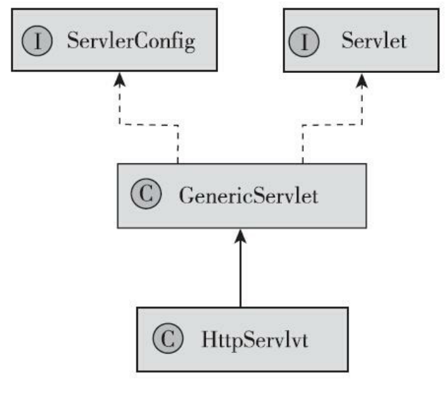
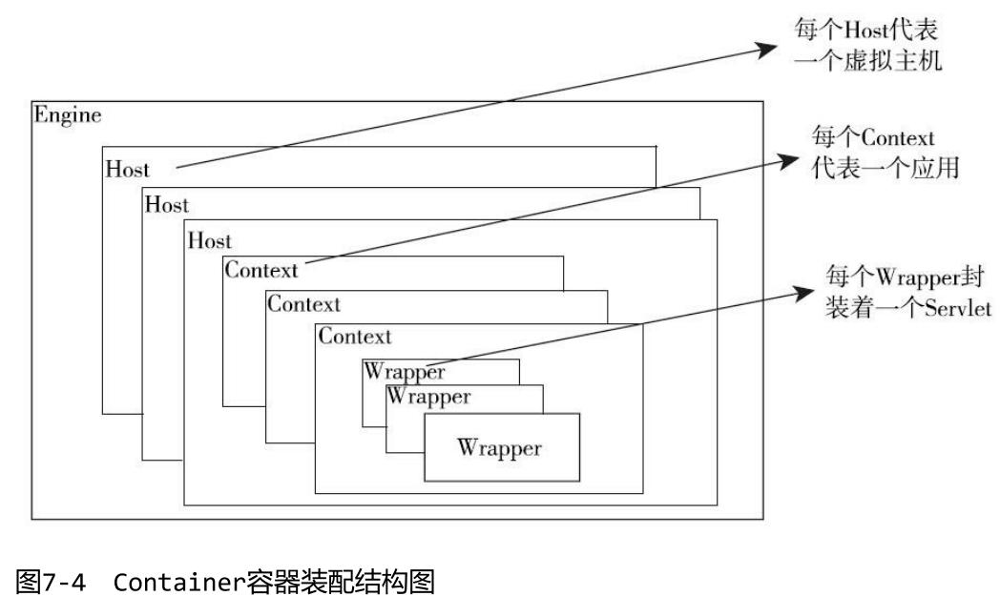
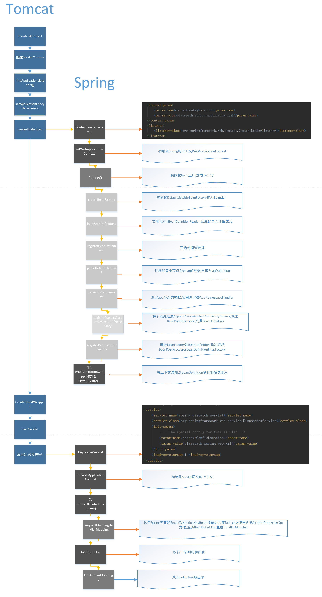

# Servlet



## Servlet接口

```java
javax.servlet.Servlet public interface Servlet { 
    //容器启动时调用，只会调用一次
    public void init(ServletConfig config) throws ServletException;
    //获取一个servlet配置对象
    public ServletConfig getServletConfig(); 
    //具体处理一个请求
    public void service(ServletRequest req, ServletResponse res) throws ServletException;
    //获取Servlet相关信息，如作者版权等
    public String getServletInfo(); 
    //Servlet销毁时释放资源，只会调用一次
    public void destroy(); 
}
```

## ServletConfig接口

```java
package javax.servlet; 
import java.util.Enumeration; 
public interface ServletConfig { 
    //获取servlet的名字，即web.xml中的<servlet-name></servlet-name>标签
    public String getServletName(); 
    //返回servlet应用本身
    public ServletContext getServletContext();
    //获取配置的init-param的参数
    public String getInitParameter(String name);
     //获取配置的所有init-param的名字集合
    public Enumeration<String> getInitParameterNames(); 
}
```

`ServletConfig`是`Servlet`级的，而`ServletContext`是 `Context`（也就是Application）级的

`ServletConfig`和`ServletContext`最常见的使用之一是传递初始化参数

```xml
<context-param> 
    <param-name>contextConfigLocation</paramname> 
    <param-value>application-context.xml </param-value>  该设置配置到了context中。
</context-param> 
<servlet> 
    <servlet-name>DemoServlet</servlet-name> 
    <servlet-class>com.excelib.DemoServlet</servlet-class>
    <init-param> 
        <param-name>contextConfigLocation</param-name>   该设置配置到了servletConfig中
        <param-value>demoservlet.xml</param-value> 
    </init-param> 
</servlet>
```

另外`ServletContext`中非常常用的用法就是保存**Application**级的属性，这个可以 使用`setAttribute`来完成，比如：
```getServletContext().setAttribute("contextConfigLocation", "new path");```
需要注意的是，这里设置的同名Attribute并不会覆盖initParameter中的参数 值，它们是两套数据，互不干扰。*ServletConfig不可以设置属性*。

## HttpServlet

`HttpServlet`是用HTTP协议实现的Servlet的基类。所以HttpServlet主要重写了service方 法。在service方法中首先将`ServletRequest`和`ServletResponse`转换为了 `HttpServletRequest`和`HttpServletResponse`，然后根据Http请求的类型不同将 请求路由到了不同的处理方法。

```java
javax.servlet.http.HttpServlet 
    public void service(ServletRequest req, ServletResponse res) throws ServletException, IOException { 
    	HttpServletRequest request;
    	HttpServletResponse response; 
    	//如果请求类型不相符，则抛出异常 
    	if (!(req instanceof HttpServletRequest && res instanceof HttpServletResponse)) { 				throw new ServletException("non-HTTPrequest or response"); 
                                                                                        }
    //转换request和response的类型 
    request = (HttpServletRequest) req; 
    response = (HttpServletResponse) res; 
    // 调用http的处理方法 
    service(request, response); 
} 
protected void service(HttpServletRequest req, HttpServletResponse resp) throws
    ServletException, IOException { 
    //获取请求类型 
    String method = req.getMethod(); 
    //将不同的请求类型路由到不同的处理方法 
    if (method.equals(METHOD_GET)) { 
        long lastModified = getLastModified(req); 
        if (lastModified == -1) { 
            doGet(req, resp); } else { 
            long ifModifiedSince = req.getDateHeader(HEADER_IFMODSINCE); 
            if (ifModifiedSince < lastModified) { 
                maybeSetLastModified(resp, lastModified); 
                doGet(req, resp); } else{
                resp.setStatus(HttpServletResponse.SC_NOT_MODIFIED); 
            } 
        } 
    } else if (method.equals(METHOD_HEAD)) { 
        long lastModified = getLastModified(req); 
        maybeSetLastModified(resp, lastModified); 
        doHead(req, resp); 
    } else if (method.equals(METHOD_POST)) { 
        doPost(req, resp); 
    } else if (method.equals(METHOD_PUT)) { 
        doPut(req, resp); 
    } else if (method.equals(METHOD_DELETE)) { 
        doDelete(req, resp); 
    } else if (method.equals(METHOD_OPTIONS)) {
        doOptions(req,resp); 
    } else if (method.equals(METHOD_TRACE)) { 
        doTrace(req,resp); 
    } else { 
        String errMsg = lStrings.getString("http.method_not_implemented"); 
        Object[] errArgs = new Object[1]; 
        errArgs[0] = method;
        errMsg = MessageFormat.format(errMsg, errArgs);
        resp.sendError(HttpServletResponse.SC_NOT_IMPLEMENTED, errMsg); 
    } 
}
```

## Tomcat

Tomcat中最顶层的容器叫Server，代表整个服务器，Server中包含至少一个 Service，用于具体提供服务。Service主要包含两部分：`Connector`和 `Container`。

`Connector`用于处理连接相关的事情，并提供Socket与request、 response的转换，

`Container`用于封装和管理Servlet，以及具体处理request请 求。

一个Tomcat中只有一个Server，一个Server可以包含多个Service，一个 Service只有一个Container，但可以有多个Connectors


Catalina是整个Tomcat的管理类，它里面的三个方法load、start、stop分别用 来管理整个服务器的生命周期

这三个方法都会按容器的结构逐层调 用相应的方法，比如，Server的start方法中会调用所有的`Service`中的start方 法，`Service`中的`start`方法又会调用所有包含的`Connectors`和`Container`的`start` 方法，这样整个服务器就启动了，init和stop方法也一样。

## Container结构

Container的子容器Engine、Host、Context、Wrapper是逐层包含的关系。



- Engine：引擎，用来管理多个站点，一个Service最多只能有一个Engine。 
- Host：代表一个站点，也可以叫虚拟主机，通过配置Host就可以添加站点。 webapps目录对应一个站点
- Context：代表一个应用程序，或者一个WEB-INF目 录以及下面的web.xml文件。 
- Wrapper：每个Wrapper封装着一个Servlet

## spring的启动流程

