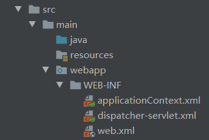
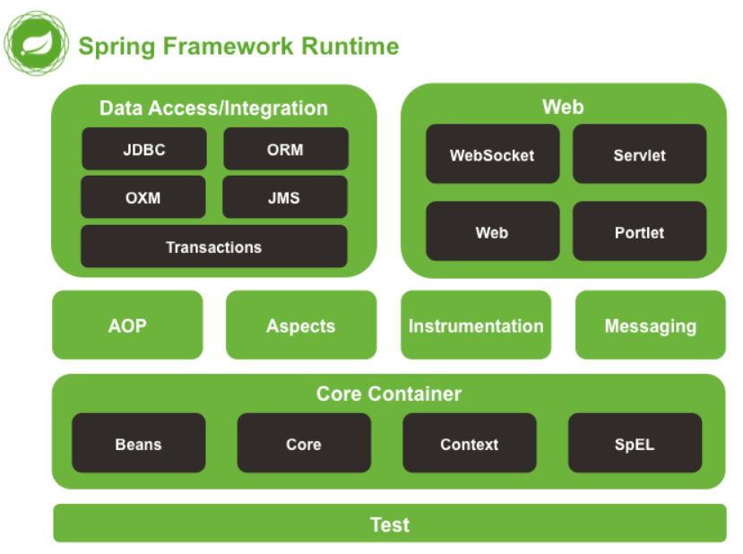

# Spring MVC项目

## 新建项目

- 使用maven创建web项目

  选取`maven-archetype-webapp`模板

- 在项目`main`目录下创建`java`以及`resources`目录，分别作为源文件根目录和资源目录

- 右键单击项目，选择`Add Frameworks Support`。然后选择`spring mvc`，为项目添加spring mvc框架。在`web-inf`目录下会出现`applicationContext.xml`和`dispatcher-servlet.xml`文件

  

- 在maven的pom文件中添加`spring mvc`依赖。

  

```xml
<!--测试-->
    <dependency>
      <groupId>junit</groupId>
      <artifactId>junit</artifactId>
      <version>4.12</version>
      <scope>test</scope>
    </dependency>

    <!--日志-->
    <dependency>
      <groupId>org.slf4j</groupId>
      <artifactId>slf4j-log4j12</artifactId>
      <version>1.7.21</version>
    </dependency>

    <!--J2EE-->

    <dependency>
      <groupId>javax.servlet</groupId>
      <artifactId>javax.servlet-api</artifactId>
      <version>3.1.0</version>
    </dependency>


    <!--mysql驱动包-->
    <dependency>
      <groupId>mysql</groupId>
      <artifactId>mysql-connector-java</artifactId>
      <version>5.1.35</version>
    </dependency>

    <!--springframework
    <dependency>
      <groupId>org.springframework</groupId>
      <artifactId>spring-web</artifactId>
      <version>4.2.6.RELEASE</version>
    </dependency>

<dependency>
      <groupId>org.springframework</groupId>
      <artifactId>spring-context</artifactId>
      <version>4.2.6.RELEASE</version>
    </dependency>
-->

<!--spring web mvc包含spring-web、spring-context、spring-bean等核心包-->
    <dependency>
      <groupId>org.springframework</groupId>
      <artifactId>spring-webmvc</artifactId>
      <version>4.2.6.RELEASE</version>
    </dependency>

    <dependency>
      <groupId>org.springframework</groupId>
      <artifactId>spring-test</artifactId>
      <version>4.2.6.RELEASE</version>
    </dependency>

    <dependency>
        <groupId>org.springframework</groupId>
        <artifactId>spring-jdbc</artifactId>
        <version>4.2.6.RELEASE</version>
    </dependency>

    <dependency>
      <groupId>org.aspectj</groupId>
      <artifactId>aspectjweaver</artifactId>
      <version>1.8.9</version>
    </dependency>

    <!--其他需要的包-->
    <dependency>
        <groupId>org.apache.commons</groupId>
        <artifactId>commons-lang3</artifactId>
        <version>3.4</version>
    </dependency>

    <dependency>
        <groupId>commons-fileupload</groupId>
        <artifactId>commons-fileupload</artifactId>
        <version>1.3.1</version>
    </dependency>

<!--添加java对象注解转json支持-->

<dependency>
    <groupId>com.fasterxml.jackson.core</groupId>
    <artifactId>jackson-core</artifactId>
    <version>2.8.5</version>
</dependency>
<dependency>
    <groupId>com.fasterxml.jackson.core</groupId>
    <artifactId>jackson-databind</artifactId>
    <version>2.8.5</version>
</dependency>

<dependency>
    <groupId>com.fasterxml.jackson.core</groupId>
    <artifactId>jackson-annotations</artifactId>
    <version>2.8.5</version>
</dependency>
```

## 项目配置文件

### web.xml

- web环境参数

  ```xml
  <context-param>
      <param-name>my_param</param-name>  
      <param-value>hello</param-value>
  </context-param>
  ```

  在此设定的参数，可以在servlet中用 getServletContext().getInitParameter("my_param") 来取得

- 过滤器配置

  ```xml
  <filter>
      <filter-name>setCharacterEncoding</filter-name>
      <!--指定filter类名称-->
      <filter-class>com.myTest.setCharacterEncodingFilter</filter-class>
      <!--初始化参数-->    
      <init-param>
          <param-name>encoding</param-name>
          <param-value>GB2312</param-value>
      </init-param>
  </filter>
  ```

- 监听器配置

  ```xml
  <listener>
      <listener-class>com.myTest.ContextListener</listener-class> 
  </listener>
  ```

- servelt配置

  ```xml
  <servlet>
      <servlet-name>ShoppingServlet</servlet-name>
      <servlet-class>com.myTest.ShoppingServlet</servlet-class>
  </servlet>
      
  <servlet-mapping>
       <servlet-name>ShoppingServlet</servlet-name>
       <url-pattern>/shop/ShoppingServlet</url-pattern>
  </servlet-mapping>
  ```

- 指定首页

  ```xml
  <welcome-file-list>
      <welcome-file>index.jsp</welcome-file>
      <welcome-file>index.html</welcome-file>
  </welcom-file-list>
  ```

- 指定错误页面

  ```xml
  <error-page>
      <error-code>404</error-code>
      <location>/error404.jsp</location>
  </error-page>
  <error-page>
      <exception-type>java.lang.Exception</exception-type>
      <location>/exception.jsp</location>
  </error-page>
  ```

- session会话超时配置(单位分钟)

  ```xml
  <session-config>    
        <session-timeout>120</session-timeout>    
  </session-config> 
  ```

- 配置Spring

  ```xml
  <!-- 指定spring配置文件位置 -->    
     <context-param>    
        <param-name>contextConfigLocation</param-name>    
        <param-value>    
         <!--加载多个spring配置文件 -->    
          /WEB-INF/applicationContext.xml, /WEB-INF/action-servlet.xml    
        </param-value>    
     </context-param>
  <listener>
          <listener-class>
              org.springframework.web.context.ContextLoaderListener
          </listener-class>
  </listener>
  ```

  之所以需要配置spring listener是因为，web.xml的加载顺序为`listener > filter > servlet > spring`

  不使用Listener加载Spring会造成bean未初始化，从而filter中使用的bean报错

### applicationContext.xml

该文件主要配置应用上下文。一般配置bean、数据库连接、事务、shiro、开启任务task配置等等

在初始化时，applicationContext.xml首先初始化，而dispatcher-servlet.xml在对应的servlet实例化时启动，因此applicationContext.xml初始化在前，而dispatcher-servlet.xml初始化在后。

dispatcher-servlet.xml中的bean可以引用父类applicationContext.xml上下文中的bean，反之不可以

### dispatcher-servlet.xml

springmvc的配置文件：dispatcher-servlet.xml定义一个servlet的应用上下文，是applicationContext.xml上下文的子类。（一般配置视图解析器、扫描指定的包中的类上的注解、添加静态资源访问的支持等等）。例如：

```xml
<?xml version="1.0" encoding="UTF-8"?>
<beans xmlns="http://www.springframework.org/schema/beans"
       xmlns:xsi="http://www.w3.org/2001/XMLSchema-instance"
       xmlns:mvc="http://www.springframework.org/schema/mvc"
       xmlns:context="http://www.springframework.org/schema/context"
       xsi:schemaLocation="http://www.springframework.org/schema/beans http://www.springframework.org/schema/beans/spring-beans.xsd http://www.springframework.org/schema/mvc http://www.springframework.org/schema/mvc/spring-mvc.xsd http://www.springframework.org/schema/context http://www.springframework.org/schema/context/spring-context.xsd">

    <!--此文件负责整个mvc中的配置-->

    <!--启用spring的一些annotation -->
    <context:annotation-config/>
    
    <!-- 自动扫描装配 -->
    <context:component-scan base-package="com.gx.controller"/>

    <!-- 配置注解驱动 可以将request参数与绑定到controller参数上 -->
    <mvc:annotation-driven/>

    <!--静态资源映射-->
    <!--本项目把静态资源放在了webapp的statics目录下，资源映射如下-->
    <mvc:resources mapping="/css/**" location="/static/css/"/>
    <mvc:resources mapping="/js/**" location="/static/js/"/>
    <mvc:resources mapping="/image/**" location="/static/image/"/>
    <mvc:default-servlet-handler />  <!--这句要加上，要不然可能会访问不到静态资源，具体作用自行百度-->

    <!-- 对模型视图名称的解析，即在模型视图名称添加前后缀(如果最后一个还是表示文件夹,则最后的斜杠不要漏了) 使用JSP-->
    <!-- 默认的视图解析器 在上边的解析错误时使用 (默认使用html)- -->
    <bean id="defaultViewResolver" class="org.springframework.web.servlet.view.InternalResourceViewResolver">
        <property name="viewClass" value="org.springframework.web.servlet.view.JstlView"/>
        <property name="prefix" value="/WEB-INF/views/"/><!--设置JSP文件的目录位置-->
        <property name="suffix" value=".jsp"/>
        <property name="exposeContextBeansAsAttributes" value="true"/>
    </bean>

    <!--文件上传-->
    <bean id="multipartResolver" class="org.springframework.web.multipart.commons.CommonsMultipartResolver">
        <property name="defaultEncoding" value="UTF-8"/>
        <property name="maxUploadSize" value="3000000"/>
    </bean>
</beans>
```

## 配置mybatis-plus

### 引入依赖项

pom.xml

```xml
<!-- 整合spring -->
    <dependency>
      <groupId>org.springframework</groupId>
      <artifactId>spring-tx</artifactId>
      <version>5.2.3.RELEASE</version>
    </dependency>

    <dependency>
    <groupId>org.springframework</groupId>
    <artifactId>spring-jdbc</artifactId>
    <version>5.2.3.RELEASE</version>
    </dependency>   

<!--mysql jdbc -->
   <dependency>
      <groupId>mysql</groupId>
      <artifactId>mysql-connector-java</artifactId>
      <version>8.0.17</version>
    </dependency>

    <!--mybatis plus -->
    <dependency>
      <groupId>com.baomidou</groupId>
      <artifactId>mybatis-plus</artifactId>
      <version>3.3.0</version>
    </dependency>

    <!-- druid连接池 -->
    <dependency>
      <groupId>com.alibaba</groupId>
      <artifactId>druid</artifactId>
      <version>1.1.21</version>
    </dependency>

```

### 配置连接池

这里使用的是druid的连接连接池，在**applicationContext.xml**中配置连接池（数据源）

```xml
<!-- Import Properties -->
    <context:property-placeholder location="classpath:config/jdbc.properties"/>
    <!--创建druid连接池-->
    <bean id="dataSource" class="com.alibaba.druid.pool.DruidDataSource" init-method="init" destroy-method="close">
        <property name="url" value="${jdbc_url}" />
        <property name="username" value="${jdbc_user}" />
        <property name="password" value="${jdbc_password}" />

        <property name="filters" value="stat" />

        <property name="maxActive" value="20" />
        <property name="initialSize" value="1" />
        <property name="maxWait" value="60000" />
        <property name="minIdle" value="1" />

        <property name="timeBetweenEvictionRunsMillis" value="60000" />
        <property name="minEvictableIdleTimeMillis" value="300000" />

        <property name="testWhileIdle" value="true" />
        <property name="testOnBorrow" value="false" />
        <property name="testOnReturn" value="false" />

        <property name="poolPreparedStatements" value="true" />
        <property name="maxOpenPreparedStatements" value="20" />

        <property name="asyncInit" value="true" />
    </bean>
```

jdbc.properties中设置连接池信息（用户、密码等）

```properties
jdbc_url = jdbc:mysql://localhost:3306/mybatis_plus?useSSL=false&useunicode=true&characterEncoding=utf8&serverTimezone=GMT%2B8
jdbc_user = root
jdbc_password = 199481
```

### 配置mybatis-plus

在applicationContext.xml中配置mybatis-plus的参数

```xml
<!--定义sqlSessionFactory-->
    <bean id="sqlSessionFactory" class="com.baomidou.mybatisplus.extension.spring.MybatisSqlSessionFactoryBean">
        <property name="dataSource" ref="dataSource"/>
        <property name="globalConfig" ref="globalConfig"/>
        <property name="plugins">
            <array>
                <bean class="com.baomidou.mybatisplus.extension.plugins.PaginationInterceptor"/>
            </array>
        </property>
    </bean>

    <bean id="globalConfig" class="com.baomidou.mybatisplus.core.config.GlobalConfig">
        <property name="dbConfig" ref="dbConfig"/>
    </bean>

    <bean id="dbConfig" class="com.baomidou.mybatisplus.core.config.GlobalConfig.DbConfig">
        <property name="keyGenerator" ref="keyGenerator"/>
    </bean>

    <bean id="keyGenerator" class="com.baomidou.mybatisplus.extension.incrementer.H2KeyGenerator"/>

    <!--扫描mapper-->
    <bean class="org.mybatis.spring.mapper.MapperScannerConfigurer">
        <property name="basePackage" value="com.liu.dao"/>
    </bean>	
```

## 单元测试

### 引入依赖包

pom.xml

```xml
<!-- 测试框架 -->
    <dependency>
      <groupId>org.springframework</groupId>
      <artifactId>spring-test</artifactId>
      <version>5.2.3.RELEASE</version>
      <scope>test</scope>
    </dependency>

    <dependency>
      <groupId>junit</groupId>
      <artifactId>junit</artifactId>
      <version>4.12</version>
      <scope>test</scope>
    </dependency>
```

### 编写测试类

`SpringRunner`和`SpringJUnit4ClassRunner`功能一样，使用前者名字简单。

```java
import com.liu.dao.UserMapper;
import com.liu.entity.User;
import org.junit.Assert;
import org.junit.Test;
import org.junit.runner.RunWith;
import org.springframework.beans.factory.annotation.Autowired;
import org.springframework.test.context.ContextConfiguration;
import org.springframework.test.context.junit4.SpringJUnit4ClassRunner;
import org.springframework.test.context.junit4.SpringRunner;

import java.util.List;

@RunWith(SpringRunner.class)   //运行环境
@ContextConfiguration({"classpath:config/applicationContext.xml","classpath:config/dispatcher-servlet.xml"})   //加载spring 上下文
public class HelloTest {

    @Autowired
    private UserMapper userMapper;

    @Test
    public void controllerTest(){
        List<User> userList = userMapper.selectList(null);
        Assert.assertEquals(5,userList.size());
        userList.forEach(System.out::println);
    }
}
```

